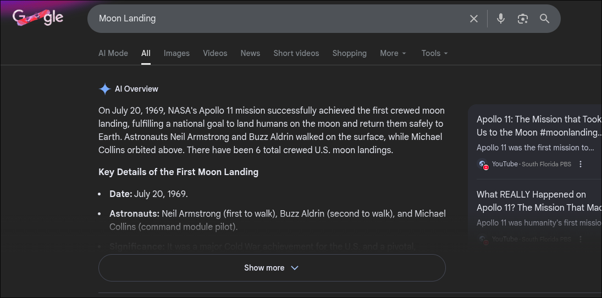

## AI Summaries

The [summarization of digital media](https://www.youtube.com/shorts/62FryBYrZzA) has become one of the most prominent and impactful applications of artificial intelligence in recent months. YouTube has introduced a feature that instantly generates a text summary of any video on the platform, enabling users to extract  information from a video without actually watching it. Other platforms are implementing content summary features as well. Microsoft Copilot can summarize your emails, [Spotify Recap](https://newsroom.spotify.com/2025-11-13/audiobook-recaps-beta-test/) can summarize audiobook chapters, and Google will even summarize the entire internet for you with AI Overviews. These “AI summary” features seem to be invading every content consumption platform on the internet.

People are interacting less and less with source material as they grow more accustomed to — and accepting of — AI-generated summaries. Why would I spend my valuable time watching a 30-minute video or perusing a dozen different websites when I can get the same information from an AI-generated summary? Many folks are settling for AI summaries and chatbot responses for answers to all their questions, skipping the search engine entirely. As a result, the information we watch, read, and listen to is increasingly being filtered through an AI lens.

With this in mind, let’s play out what the future of online content might look like. Let’s assume that AI summaries and chatbots only become more widespread, invading every aspect of our digital lives. For some people, large language models (LLMs) will be the primary interface through which they access the internet. Informational sites like news outlets, blogging platforms, and academic resources will be all but abandoned by actual humans, accessed primarily by web scrapers to feed data-hungry AI models.

In this future, I think it’s reasonable to believe that content creators will seek ways to optimize their material not for humans, but for AI summarization. Creators will publish their content in such a way that AI models cite their material instead of others — that is, if the AI bothers to cite its sources at all. Websites will no longer be built to climb search rankings; they will be engineered to win the “recommendation” of the AI agents that now gatekeep the web. Search engine optimization will soon be replaced by search **agent** optimization. 

## The Death of Web Surfing?

I think it’s entirely plausible that AI becomes a kind of “universal frontend” for nearly every digital experience, fundamentally reshaping how humans interact with the internet. In an AI-first architecture, people would no longer navigate websites or apps directly, but instead rely on a personal AI agent to access and mediate digital services on their behalf. For example, a news organization might stop investing in a polished website and instead publish its content as structured plaintext, allowing AI systems to ingest, summarize, and deliver it conversationally to readers. Companies could similarly abandon traditional smartphone and web applications in favor of exposing MCP-powered APIs that communicate with user-facing chatbots. In such a world, digital services would be designed primarily for machine-to-machine communication, while the AI becomes the only interface humans ever see.

One might assume that interaction-heavy platforms like online retailers, banking apps, or email clients are insulated from this shift, but I beg to differ. Amazon has long enabled voice-based purchases through Alexa, foreshadowing a world in which users transact through intermediaries rather than interfaces. More recently, integrations like [ChatGPT’s Instacart plugin](https://www.instacart.com/company/updates/instacart-chatgpt) demonstrate how an LLM can complete purchases on a user’s behalf without the user ever visiting the underlying platform. Whether ordering groceries, managing finances, or booking travel, the AI increasingly acts as an autonomous layer between consumers and services.

This shift could put many companies in a challenging position. How do you build a digital product or experience knowing that your primary “users” are computer programs? Industry leaders will face a difficult decision: do you resist this trend and try to build a human-first experience that cannot be fully appreciated through an AI intermediary, or do you jump on the hype train and optimize your product for AI agents instead of humans?

## Conclusion

In my personal opinion, delegating our everyday tasks to AI agents constitutes a quiet forfeiture of human autonomy. As our digital assistants take on more responsibilities, they slowly become less like assistants and more like gatekeepers. I’m not trying to be an AI doomer; I simply hope that AI advances in a way that preserves the freedoms of the individual. Importantly, AI should **always be opt-in** rather than a requirement for participating in society, so that people are not forced to cede control over essential decisions just to function in daily life. AI should be viewed as a tool for “improving health outcomes, education outcomes, public sector efficiency, and private sector competitiveness,” to [quote Microsoft CEO Satya Nadella](https://www.businessworld.in/article/microsoft-ceo-nadella-defines-ai-bubble-risk-at-wef-davos-2026-589972) from this year’s World Economic Forum. Because without that, "[AI] makes no sense.”