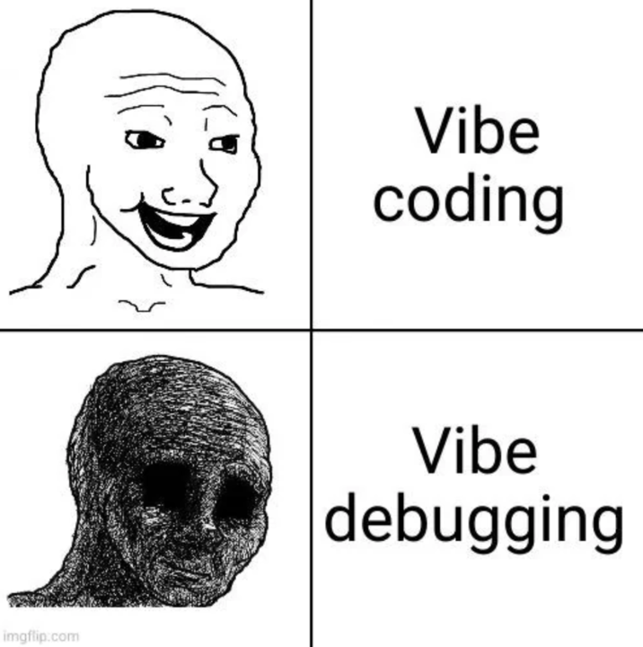

AI-assisted coding tools are polarizing, to say the least. On one end of the spectrum, you have the skeptics. Citing concerns around security, code quality, and maintainability, they remain wary of AI’s role in the software development lifecycle. On the other end, you have the "AI bulls," who argue that AI not only makes developers more efficient but will eventually outperform human-centric development altogether.

In this post, I’m not going to argue for or against AI-assisted coding. I think it is a foregone conclusion that these tools are here to stay. However, I believe that proper utilization requires a more nuanced analysis of project requirements, as well as a willingness to take ownership of the code AI produces. My goal is not to dictate your stance on AI, but to offer some guiding principles for how developers can thoughtfully and intentionally integrate these tools into their daily workflows.

## Understand When Code Quality Matters

Sometimes, code quality doesn’t matter. By any metric—readability, maintainability, security, or complexity—there are scenarios where the "correct" way to do things is secondary to speed. For example, I recently "vibe-coded" a small Python utility for my coworkers that opens a Microsoft Word document, applies some formatting changes, and saves it. I didn’t care if the script used an outdated library, failed a type-checker scan, or ignored established Pythonic conventions. It was a simple, functional script, and that was all that mattered.

Another domain where I am (personally) less concerned with rigid quality standards is frontend web development. Specifically boilerplate HTML and CSS. Since most of that code defines the visual layer of the application (and I am an awful web designer anyway), I am perfectly comfortable outsourcing that heavy lifting to an LLM.

Many applications, however, have at least a few components that require a high degree of rigor. Code that, for example, handles payment information or sensitive user data necessitates precision. Similarly, performance-critical paths require careful human oversight.

This is where human experience and expertise come into play. AI can generate code, but it cannot determine your project's risk tolerance or business priorities. An experienced engineer understands which parts of a system demand rigorous testing, careful design, and conservative implementation, and which parts can safely prioritize development speed. AI can assist with implementation, but it cannot replace engineering judgment.

As a developer, it is your responsibility to analyze your project requirements, determine which areas of the application cannot be compromised, and ensure that AI-generated code receives the appropriate level of scrutiny. Not every line of code deserves the same level of attention, but every line deserves a level of attention appropriate to its impact.

To be clear: I am not arguing against using AI in all quality-sensitive applications. But in 2026, it is incredibly easy (and tempting!) to produce working code that you do not actually understand. But generating code you cannot explain is a liability. For example: If you are a senior developer, part of your value lies in mentoring juniors. That task becomes more challenging if you are simply rubber stamping every pull request without taking the time to fully comprehend what's being committed. This brings us to the core issue of AI-assisted software development: code ownership.

## The Buck Stops With You

Using AI to generate code does not absolve you of the responsibility to understand, maintain, and effectively communicate the function of that code to your team. Whether the logic came from your head or an LLM, **the buck stops with you**. Coding assistants are tools, not scapegoats. Properly implemented, AI should enhance a developer’s preexisting skill set, not act as a crutch for a lack of knowledge.

When an autonomous Uber vehicle struck and killed Elaine Herzberg in Arizona in 2018, the legal and ethical responsibility fell to Uber and the systems they deployed, not the vehicle's software. So it is with AI-generated code. When a client encounters an issue with software that you shipped, it is your responsibility to own the problem and develop a fix. "Sorry, my AI agent wrote that" will never be an acceptable excuse for shipping defective software.

*"The leader must own everything in his or her world. There is no one else to blame. The leader must acknowledge mistakes and admit failures, take ownership of them, and develop a plan to win.*

*The best leaders don't just take responsibility for their job. They take Extreme Ownership of everything that impacts their mission."*

\- Jocko Willink  and Leif Babin, Extreme Ownership

## Conclusion

I don't think AI is going to eliminate the need for software engineers anytime soon. At the end of the day, software is a product created by humans, for humans. As AI empowers more people to write software, there will be a growing need for experienced engineers who can truly understand and evaluate its output. Those who use AI intentionally and take extreme ownership of their code will thrive, while those who simply act as conduits for LLM-generated output will be left behind.

## Related Reading

- [Linus Torvalds on using AI for Linux Kernel Development](https://lore.kernel.org/linux-media/CAHk-=wi4zC+Ze8e+p3tMv8TtG_80KzsZ1syL9anBtmEh5Z40vg@mail.gmail.com/)
- [Extreme Ownership Book](https://www.amazon.com/Extreme-Ownership-U-S-Navy-SEALs/dp/1250067057)
- [Death of Elaine Herzberg - Wikipedia](https://en.wikipedia.org/wiki/Death_of_Elaine_Herzberg)