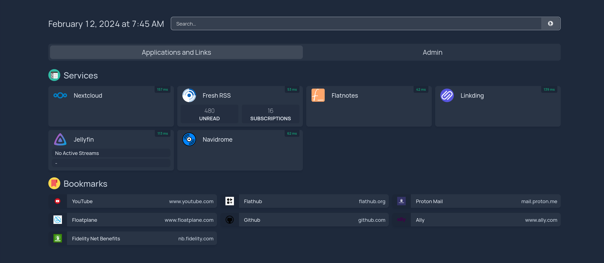
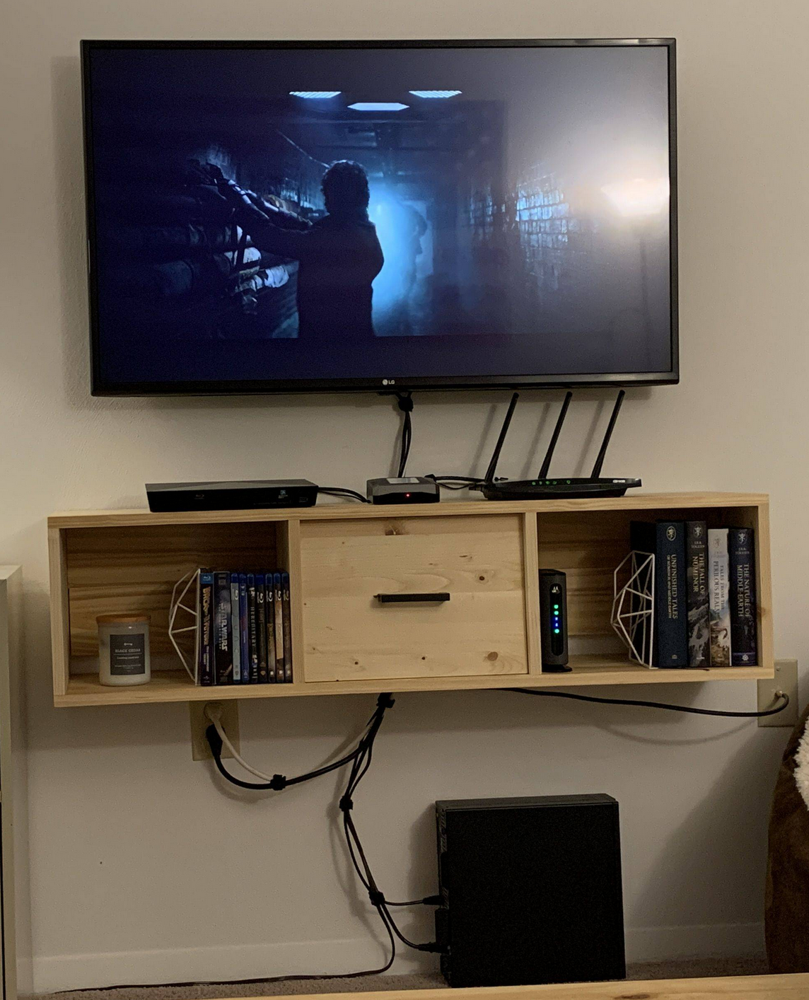

## Humble Beginnings

My homelab journey started around 3 years ago while I was an undergrad studying computer science. I had gotten fed up with paying Google every month just to store my photos and files. I wanted a solution to store all my photos and files locally. As a student, I had no money at the time, so I purchased a Raspberry Pi. Following [an excellent guide by Jay LaCroix from on Learn Linux TV](https://www.youtube.com/watch?v=y4dtcr2NL5M), I soon had my very own personal cloud. I used Google’s takeout feature to exfiltrate all my digial assets. After importing all my data to Nextcloud, I had accomplished the original goal: *get my data under my own roof*.

I was content with my creation. I had a tiny, power-efficient server that housed all my photos, files, contacts, and calendars. Setting up Nextcloud taught me a lot about Linux servers and basic networking concepts. It also opened me up to the world of self-hosting and introduced me to the vibrant homelab community. I had originally only planned to run Nextcloud, but I quickly learned that there is *so much more* to explore. 

## Docker

I set up Nextcloud on my Pi to run on bare metal. While it's not a terribly complex process, I wanted more portability in my server. For this reason, I decided to switch my Nextcloud instance to Docker. What I liked about Docker was that it gave me the ability to quickly destroy and re-deploy services while persisting my data through Docker volumes. I also liked that the deployment process was similar reguardless of the docker image being used. My first additional service containers were [FreshRSS](https://github.com/FreshRSS/FreshRSS), an RSS feed aggregator, and [Linkding](https://github.com/sissbruecker/linkding), a bookmark manager. I put everything behind a reverse proxy called [Traefik](https://doc.traefik.io/traefik/) (also running in a Docker container) which allowed me to access my services via my own domain.

It was around this time that I made a crucial decision about my homelab: **Docker or Die.** That is to say, I only want to run services that can be run in a Docker container on my homelab. I made this choice for one main reason: ease of maintenance. To make backups, I can simply backup all my docker volumes, which are stored under a single directory. Add some tags to the docker-compose and Traefik will handle the certificates automatically. If a service isn’t working, I always start with the docker logs for that service and see what's happening. 

I know some cool things can be done with hypervisors like ProxMox, but for me, I don’t think the additional system complexity is worth the potential upsides. (At least for the time being.) Not using a hypervisor reduces the number of failure points that I have to check when something goes wrong. I want my services to “just work” with minimal downtime. *If I have to spend more time maintaining my server than I do using my services, then I have missed the point of homelab entirely.*

## Ansible

I also decided to take my docker-compose files a step further by converting them to Ansible playbooks. This gave me another level of automation and made my deployment process even faster. I would highly recommend [Jeff Geerlings Ansible for DevOps](https://www.jeffgeerling.com/project/ansible-devops) as it was a great resource for me when I was just getting started.

A few things I like about Ansible:

- **Ansible Vault**: Ansible Vault is a mechanism for storing sensitive playbook information (API keys, usernames/passwords, etc.) in an encrypted text file. I also use the vault as a central location for all my playbook variables. I just like having one file to go to when I want to change something (which isn’t the primary use case for Vault, but it works for me.)
- **Templates**: Many services utilize some sort of JSON/YAML/TOML file to configure options within the service. With Ansibles Template mechanism, I can use my vault variables within the configuration file and Ansible will automatically fill in the values when the file is copied to the target machine. This is especially useful for services like Homepage that have a large number of configuration options.

## More Power

The Raspberry Pi is an amazing little computer, but it was beginning to struggle a bit (especially in Nextcloud) running all my containers. In the first of what would be a series of hardware transitions, I transformed my desktop gaming PC into an Ubuntu server. I moved my docker volumes directory to the new drive, ran my Ansible playbooks, and I was up and running again in no time. I purchased a mid-range NVIDIA GPU a few years back, which I utilized for hardware acceleration in [Jellyfin](https://jellyfin.org/), a recent addition to my container fleet.

This worked well for a time, but I started to miss my desktop and my gaming monitor was collecting dust in the corner of my room. Inspired by an [LTT video on up-cycling old hardware as a home server](https://www.youtube.com/watch?v=zPmqbtKwtgw), I purchased a Dell Optiplex Desktop on Facebook Marketplace for $80. It has a 7th gen Intel i5 and 8GB of DDR3, a solid base on which I could build. I cleaned it up a bit, swapped the spinning disk drive for an SSD, migrated all my containers, and I was good to go. As a bonus, it came with a CD drive which I could use for ripping DVDs and CDs.

This brings me to the current day where I am still running all my containers on the Optiplex. However, I have made a few upgrades, particularly in the networking department. The biggest upgrade was replacing my TP-Link router with a dedicated OPNsense box. In addition to performing the usual routing/firewall duties, it also runs a Wireguard instance, giving me access to my server from outside my local network. I also purchased a rack, a basic unmanaged network switch, and a cheap PDU from Amazon to round it out. (It is very much still a work in progress.)

The Raspberry Pi I started with has now been repurposed as a Pihole. I set up the OPNsense box to forward all DNS requests to the Pi, which blocks advertisement and tracking requests. My TP-Link router/wireless access point had its router duties revoked, now handling just the latter. I’m still using the Optiplex for my docker containers, but I have a 4U chassis from [Sliger](https://www.sliger.com/) ready to accept some new server hardware. (I had originally planned to put the Optiplex internals in the 4U chassis, but it has a proprietary Dell motherboard and power supply, neither of which will install correctly into the chassis.) I plan to purchase some new hardware for the Sliger chassis and turn the Optiplex into an HTPC.

## Professional Applications and Lessons Learned

I’ve enjoyed setting up all this equipment for my personal use. But the cool thing about homelab is that these skills are also marketable in a professional environment. I’ve learned about a wide array of topics such as:

- Setting up a Linux server and performing basic management tasks
- Configuring and spinning up containers with Docker
- Automating server tasks with Ansible
- Networking concepts like sub-netting, port forwarding, and firewall rules

In conclusion, here are some lessons I have learned during my homelab journey that I would like to share:

- **Start small**: You don’t need to run out and buy a ton of expensive equipment if you are starting from scratch with no prior experience. My Raspberry Pi was a great introduction to self-hosting and it allowed me to gain a lot of experience for a low price.
- **One thing at a time**: Focus on one task at a time. It’s easy to have multiple sub-projects in progress at once, like converting docker-compose files to Ansible playbooks, writing new playbooks for new services, or setting up PiHole. Taking on too many tasks at once causes me to lose track of what I’m trying to accomplish and I would fail to complete anything at all. Setting small goals and focusing on implementing a singular feature helped me progress faster in my homelab journey.
- **Document everything**: Take notes on your system configuration. It is helpful to have a reference guide to refresh your memory when you are troubleshooting a service that has suddenly stopped working. And this doesn’t just mean taking notes. I've found it helpful to download offline copies of articles and tutorials that I used to configure things in my lab. Create diagrams of your entire system so you know what is running and what it is running on.

If you made it all the way through this article, thanks for reading! I hope to produce more technology related writing like this in the future. I plan to post updates on my new hardware and services as the homelab continues to grow.
