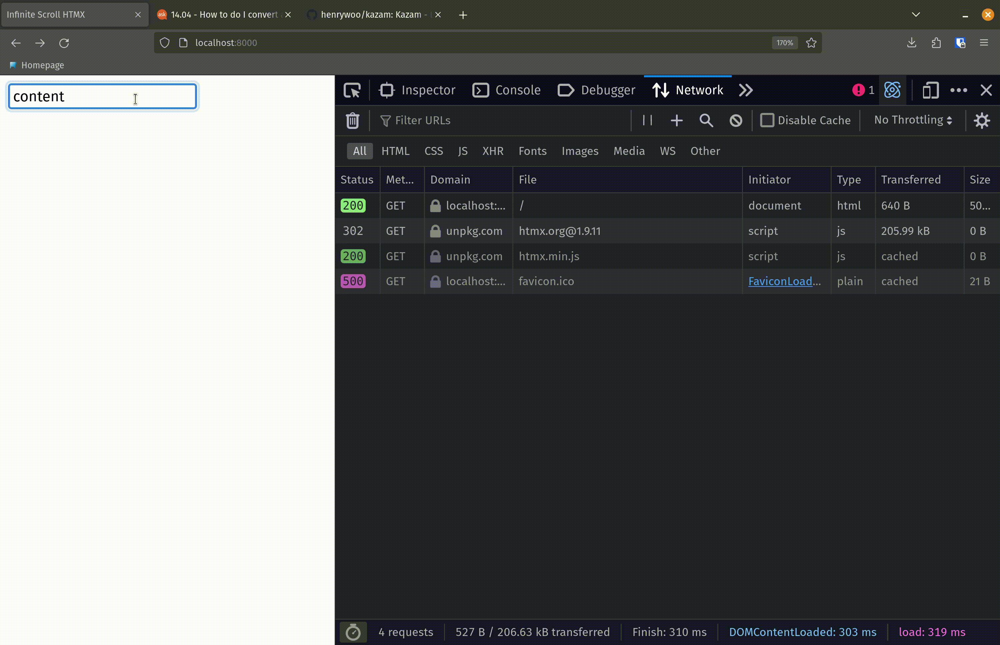

The source code for this demo is available [here](https://github.com/noahhefner/website-code/tree/main/infinite-scroll-htmx). Instructions for setting up the project are in the README.

# Context

I am working on a project at my day job where we are building a documentation site for a very large and complex software system. We have over 20,000 technical documents outlining how the software works. Our customer needs a way to search, browse, and update these documents efficiently. Our current proposed solution uses a Python/FastAPI web server, MongoDB to store the document data, and HTMX to handle frontend updates. (I am not able to make my work repo publicly available, so I have pulled out only the essential logic portions for this demo.) The purpose of this article is to show how we have implemented the "infinite scroll" functionality for the document search results page with our chosen tooling. The ideas, however, should be easily adaptable to other languages (as long you're using HTMX.) *Familiarity with HTMX is recommended before reading this article.*

# Problem

When searching for a query in the database, there can be hundreds or thousands of results returned. This causes the front end to lock up while the web server builds the HTML to return to the client. We can partially solve this problem by using a limit on our query to MongoDB so that we can return only the first X number of matches to the client. Then the server can respond as soon as those X number of matches are found and we don't have to wait for the search to execute on the rest of the database.

But then the question arises, how do we get the next X matches? If we choose to implement the results page with an infinite scroll approach, then we need a way to load the next X results when we reach the bottom of the current results.

# Solution

Let's start with the `/search` endpoint:

```python
# search.py

import os
import time
from fastapi import Request, Query
from app import templates
from app.router import router
from app.database import documents
import time

@router.get("/search")
async def serve_search_results(request: Request, query: str = Query(None), limit: int = Query(10, ge=0), skip: int = Query(0, ge=0)):

    results = await documents.search_content(query, limit, skip)

    matches = []

    for result in results:

        doc_info = {
            "title": result['title'],
            "description": result['description'],
            "url": "/docs/{}".format(result["title"])
        }

        matches.append(doc_info)

    context = {
        "matches": matches,
        "query": query,
        "limit": limit,
        "skip": skip
    }

    return templates.TemplateResponse(request = request, name = "searchResults.html", context = context)
```

The `/search` endpoint accepts three URL parameters:

- `query`: This is the query we are searching for. In the context of my project, this is the string we are searching for in the contents of the documents. The default value is `None`.
- `limit`: Match limit for the MongoDB database. When there are more than `limit` number of matches in the database, only return the first `limit` matches. The default value is zero and the value given must be greater than or equal to zero.
- `skip`: When there are multiple matches in the database, skip the first `skip` number of matches. The default value is zero and the value given must be greater than or equal to zero.

When the endpoint is hit, the first step is to search the database for the provided query. We pass along the search query, the limit, and the skip values to the database module. This operation will give us back a list of documents from the database where the `"content"` field contains the given query.

Next, we build the context to be passed to the `searchResults.html` template. For each document in the results, we build an object with that document's title, description, and URL. The `context` variable contains the list of match objects, *along with our query, limit, and skip values*. This is key!!

Finally, we pass the context to the `searchResults.html` template and return.

Next, let's look at `searchResults.html`:

```html
<!-- searchResults.html -->


    
        <div hx-get="/search?query={{ query }}&limit={{ limit }}&skip={{ skip + limit }}" hx-trigger="revealed"
            hx-swap="afterend">
            <a href={{ match["url"] }}>
                <h2>
                    {{ match["title"] }}
                </h2>
            </a>
            <p>
                {{ match["description"] }}
            </p>
        </div>
    
        <div>
            <a href={{ match["url"] }}>
                <h2>
                    {{ match["title"] }}
                </h2>
            </a>
            <p>
                {{ match["description"] }}
            </p>
        </div>
    

```

Let's break down what is happening here: For every match in the context, we are building a simple `div` containing a link to the document and a short description of that document. If the current match is not the last in the list, just build the link and the description. If the current match is the last match in the list and the index is equal to the limit (we will come back to this in a second), then we add an `hx-get` to that div. The `hx-trigger` attribute is set to `revealed`, meaning that the GET request will be fired whenever this `div` is shown in the client's browser. (Remember we are implementing this as an infinite scroll, so this last div will probably not be initially visible when the results are loaded.)

In the `hx-get`, we set the URL to be our search endpoint `/search` and add our query parameters. The query is simply the same query from the initial (first) request. The limit is also the same limit from the initial (first) request. The skip parameter, we are now setting to be `skip + limit`. 

Let's work through a quick example to see why we need this. Say we execute a search and there are 100 results. On the first request to the endpoint, our values for the parameters will be:

```
/search?query=somequeryhere&limit=10&skip=0
```

This will return to us the first 10 results of the 100 results. On the next call to the endpoint, which will be triggered by the `hx-get` attribute above, the `skip` value will be 0 + 10, or 10. So we will skip the first 10 results (which have already been rendered in the client's browser) and fetch the next 10.

Now back to the second condition, `loop.index == limit`. This additional check is to account for the case where the number of results from the database query is less than the limit. If the limit is 10, but there are only 6 search results, then the 6th element would be given the `hx-get` attribute without this condition. This means that when the 6th element is revealed, another GET request will be fired off, only to return no results. In practice, this condition isn't strictly necessary, it simply saves an additional call to the server that we know in advance does not need to be made.

# Results



Here is the result! When the search is first executed, the first 10 results get loaded into the client's browser. The user scrolls down, eventually revealing the 10th result in the list, at which point HTMX triggers another GET request to fetch the next 10 results from the database. Those results are then appended to the end of the list. The user continues to scroll, incrementally loading results in sets of 10 until all the results from the search have been presented.

# Conclusion

HTMX has an [official page](https://htmx.org/examples/infinite-scroll/) on implemented infinite scroll, but I found the explanation to be lacking in depth, which is what inspired me to create this demo. Hopefully, the fully-implemented example provided in the repo linked above will provide a deeper understanding of the concepts presented.

Thanks for reading!