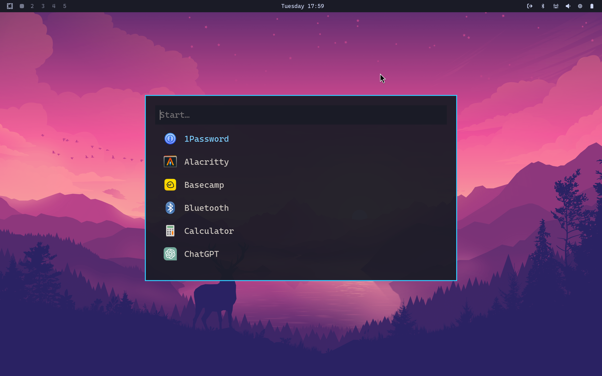

For the uninitiated, the "year of the linux desktop" is a running joke in the linux community referring to the idea that \<current year\> will be the year that Linux goes mainstream for regular desktop usage. That is to say - Linux will see widespread adoption for personal computing use amoungst behemouths such as Microsoft Windows Mac OS. While the prophecy is yet to be fulfilled, I remain hopeful that LInux will one day be a viable operating system for everyday folks.

## First Contact with Linux

My very first exposure to Linux was in high school. At that time, I was just discovering my love for computer programming. Based on my hours of internet research, I had come to the conclusion that linux was "good for programmers" - whatever that meant. I determined that in order to be a good programmer, I needed to be using Linux (an opinion that I still hold today, though for drastically different reasons.)

As I graduated high school and went to college to study computer science, my interest in linux stuck with me. I had started out using Ubuntu, but quickly developed a habbit of distro-hopping, hopelessly searching for that "perfect linux desktop" for me. Some memorable highlights from that timer were [Elementary OS](https://elementary.io/), [Fedora Desktop](https://fedoraproject.org/), and [Pop!_OS](https://system76.com/pop/). But alas, the grass was always greener on the other side. I never quite found one desktop that I truly loved using. Each one seemed to have some quirk that wasn't quite right for me.

## Skill Issues

Around this time, [Wayland](https://wayland.freedesktop.org/) was emerging as the next generation Linux display manager. I didn't quite know what that meant at the time (and honestly I still don't have a great grasp of the concept), but one project that came across my radar through the Wayland hype train was [Sway](https://github.com/swaywm/sway), a tiling window manager meant to usurpe [i3](https://github.com/i3/i3) in the Wayland era. I didn't know what i3 or Sway or "window tiling" was, but I was intrigued by the minimalism. Sway ships with literally the bare minimum required to display things on your screen. "Zero "bloatware" in my system? Just a bare-bones graphical environment where I choose all the applications to install? Seems neat!"

Little did I know, I had just stepped into a very, very deep rabbit hole. "Zero bloat" sounds like a nice concept, until you have to do a basic task like, say, connect to the freaking internet. On Gnome, I would just open the settings application, click my SSID, and put in my WiFi password. Not so with Sway! There is no settings application at all! You need a tool like `nmtui` or `iwctl` for that. Do you need a status bar to see which workspace your on or, I don't know, the *time*? Cool, you can install Waybar and read through the hundreds of options available in the configuration file. Do you want functional speakers on your computer? Well, you better get familiar with Pipewire, Pulse audio, and the half dozen supporting packages needed to get sound to come out of your machine. You even need a separate package just to put a background on your freaking desktop. I am being overly dramatic, but the point is, to a complete linux noob, this was all super overwhelming. I didn't know what I didn't know and I had trouble even figuring out what was wrong when my machine wasn't working as I wanted it to. It was cool for sure, but it was also painful - a far cry from the install-and-go nature of the distros from the big players.

After a few years of wiping and reconfiguring my laptop every few months, I finally just settled for Fedora desktop. Fedora ships with the Gnome desktop environment, which was "boring", but also stable, well maintained, and easy to use. Having borked my setup on several occasions trying to tweak things myself, I gained an appreciation for the simplicity of the Fedora/Gnome experience. With almost no extra configuration after installation, everything seemed to "just work" out of the box on all my systems.

## A New Hope

And then DHH released [Omarchy](https://github.com/basecamp/omarchy). Unlike established options like Ubuntu and Fedora, Omarchy is not a linux "distribution" in the purest sense of the word. It is essentially an Arch system with some preinstalled applications, configuration files, and an arsenal of bash scripts to help the user perform common tasks.



When Omarchy was first released, the install process was a bit unique. The installation instructions first have you install Arch linux using the `archinstall` helper command, selecting a few specific configuration options to prepare the system for Omarchy. Then, you would run a curl command to download the Omarchy configuration files and scripts. Finally, simply run the install scripts, reboot the system, and you've got a fully functional, fully configured desktop environment. (This process has all since been abstracted away and an Omarchy ISO is now available to use.) At a high level, Omarchy isn't a distribution, but a reproducable set of instructions generate a desktop environment to a given specification. 

I ultimately decided that Omarchy wasn't for me. There's too much stuff installed that I do not use. (It is an *opinionated* configuration after all.) However, I loved the idea of setting up a desktop environment through bash scripts. Not only are the scripts useful for quickly reproducing a desktop environment on several systems, but they are also self-documenting. If I ever forget how an application or package was configured on my system, I can simply go read the bash script and see exactly what it did.

Inspired by Omarchy, I revisited my previously abaondoned dotfiles repository and got to work.

## Choosing a Base Distribution

The first choice to be made was which distribution I was going to build me system on. After much deliberation, the decision came down to Debian 13 and Arch. Ultimately I chose Arch for three reasons:

1. [The Arch Wiki](https://wiki.archlinux.org/title/Main_page) - The Arch Wiki is an invaluable resource for learning about Linux. If it runs on Arch, there's a good chance the Wiki has a page for it. I used the Wiki heavily while setting up my system and I continue to use it for troubleshooting and learning.
2. [The Arch Linux User Repository (AUR)](https://aur.archlinux.org/) - Generally speaking, installing software on your computer from random people on the internet is ill-advised. However, there are a handful of packages I wanted to install that are only available through the AUR (at least on Arch). I use the AUR sparingly, but it is nice to have those packages available to me.
3. Support for the latest Packages - Stability often comes at the cost of having the latest and greatest, which was ultimately what pushed me from Debian to Arch. On Arch, it's safe to assume that when I install a package, it's probably the latest version. But with Debian, you may need to jump through a few hoops to get the latest version, such as enabling the unstable repository or manually downloading a `.deb` package, and even then, you may not get the latest version.

## Hyprland


Next, I needed to choose a window manager. I considered going back to Sway, simply because I was familiar with it. But after seeing how awesome Hyprland was with Omarchy, I decided to do a bit more research on it. I was pleasently surpsised to find a that that Hyprland documentation is very extensive and extremely useful. The docs do more than just explain how Hyprland works--they are a guide for building a complete desktop experience on Hyprland. [The "Useful Utilities" pages](https://wiki.hypr.land/Useful-Utilities/) are a great example of this. These pages cover all the additional bits that most users will *probably* want to configure, such as a notification daemon, a status bar, or a desktop wallpaper. For the tiling window manager veterans, this all seems obvious, but for newcomers like myself, these notes are incredibly useful.

## Packages and Applications

The next thing I did was to create a text file listing all the packages I wanted to install on my system. With a bit of scripting, I can just one-shot install all these packages in a single command. Here's some examples:

```plaintext
# Printing
cups
cups-browsed
cups-filters
cups-pdf

...

# Login manager
greetd
greetd-regreet

# Dependency for Flameshot
grim

# Static site generator
hugo

...

# GUI for managing displays
nwg-displays

```

The comment above each package is to remind future me why I installed the package and what it is for. With these comments, I won't accidentally remove a package that I *thought* wasn't being used, but is actually a dependency for something else, for examle. I have similar files for AUR packages and Flatpaks.

## Setup Scripts

Following in Omarchy's steps, I wrote (or stole from the Omarchy repo) some bash scripts to setup my system. I broke the process into five separate scripts as opposed to one massive script. This was useful for testing things out when I was just getting started. I ended up with the following workflow:

```sh
# Installs yay, an AUR helper
. setup.sh
# Installs packages listed in the aforementioned text files
. install.sh
# Move config files to the correct locations
. configs.sh
# Miscellaneous tasks (enable systemd services, add user to docker group, etc.)
. post-setup.sh
```

Reboot the machine, then run:

```sh
# Install flatpaks + flatpak configuration
. post-reboot.sh
```

## Takeaways

What Omarchy proved to me was that with enough configuration and attention to detail, it was actually possible to achieve a polished, coherant, and complete user experience with a tiling window manager. Getting there will require a lot of time, trial and error, and research, but the end end result is a system that is taylor-made for me.