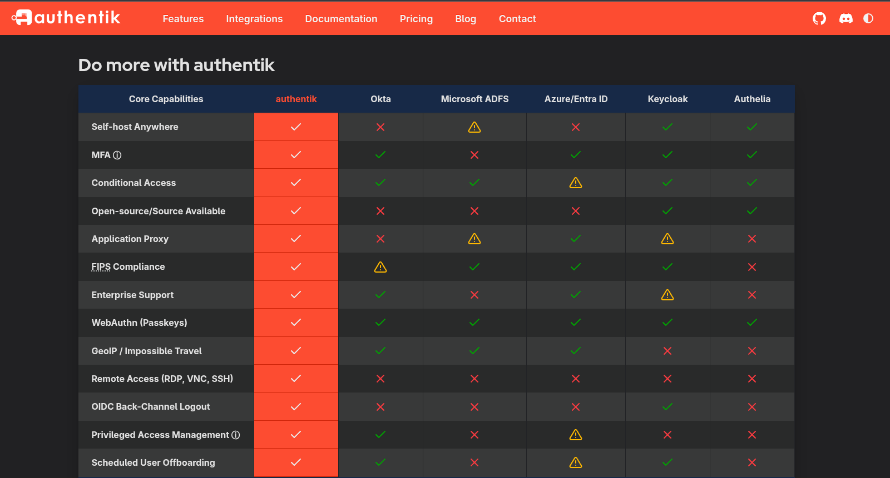
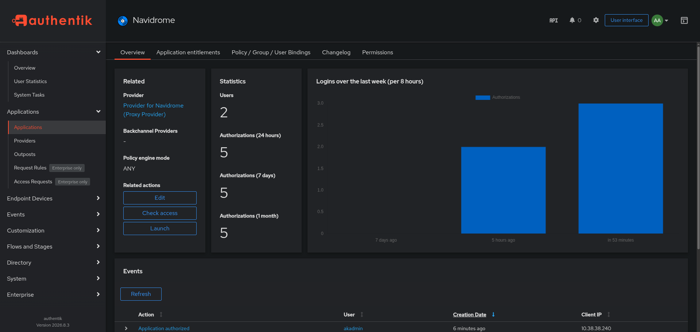
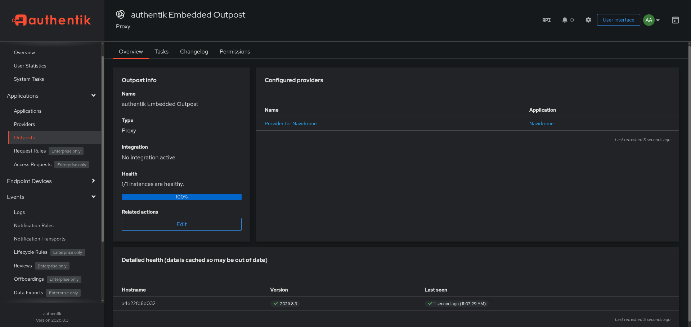
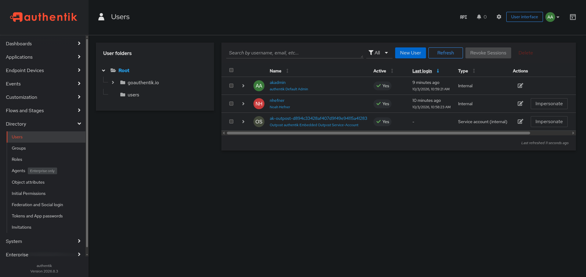
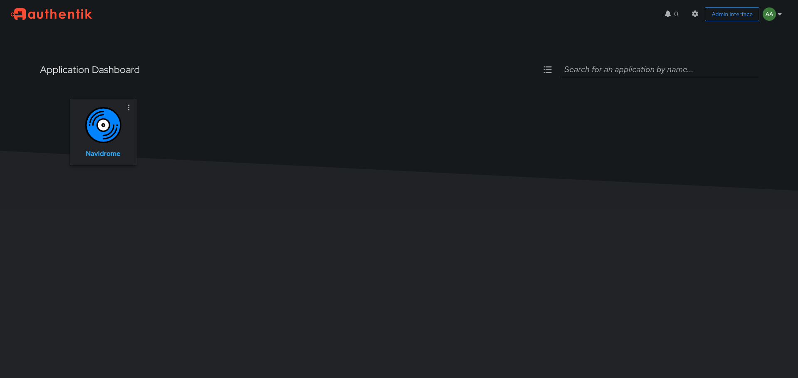


Unlike my usual posts, this guide is primarily for my own reference. SSO is complicated, and when this setup inevitably breaks in some way in 6 months or a year, hopefully this guide will remind me of how the heck everything is put together and aid in the troubleshooting process. Anyways, if you happen to be replicating my exact setup or are interested in deploying Authentik for your own homelab, I hope you find this guide helpful!


## Intro

Recently, I've been researching single sign-on (SSO) options for my homelab services. The primary motivation for this is that I want to give my family members access to my self-hosted services, and I want to implement an easy-to-use authentication system so that they don't have to juggle a dozen different logins for all the different services.

## Authentik

After weighing the pros and cons of popular SSO services amongst homelabbers, I landed on Authentik. It is open source, well documented, and widely adopted by the community. This [feature comparison chart](https://goauthentik.io/#comparison) from their website is also very convincing:



Before fully committing and migrating my entire stack to SSO, I wanted to test the waters with a single service to gauge the complexity. I chose Navidrome as my guinea pig for this experiment. Navidrome has built-in support for SSO and a [written guide](https://www.navidrome.org/docs/usage/integration/authentication/) for implementing Authentik. The guide even has tailored configuration examples for my reverse proxy, Caddy.

## Reverse Proxy

Speaking of Caddy, let's take a brief detour to discuss Caddy's role in the SSO pipeline. At a high level, Caddy's role is to ensure all requests are authenticated with Authentik before allowing the request through to the homelab service. This is accomplished through Caddy's [forward_auth](https://caddyserver.com/docs/caddyfile/directives/forward_auth) directive in the `Caddyfile`. From the Caddy docs:

*This directive makes a `GET` request to the configured upstream with the uri rewritten:*

- *If the upstream responds with a `2xx` status code, then access is granted and the header fields in copy_headers are copied to the original request, and handling continues.*
- *Otherwise, if the upstream responds with any other status code, then the upstream's response is copied back to the client. This response should typically involve a redirect to login page of the authentication gateway.*

It is important to know that incoming requests are **not** proxied through Authentik. When Caddy receives a request, Caddy **clones** the request and sends the clone to the authentication provider. When the response is received, Caddy forwards the original request (with some HTTP headers from the authentication provider) to the service.

Conveniently, Authentik also has a generalized [written guide](https://docs.goauthentik.io/add-secure-apps/providers/proxy/server_caddy/) for implementing SSO with Caddy. Between the Caddy and Authentik docs, I cobbled together a `Caddyfile` configuration for Navidrome that offloads authentication to Authentik:

```
# Extraneous configuration options like TLS and other service configs
# removed for brevity.

*.noahhefner.info {

  @navidrome host navidrome.noahhefner.info
  handle @navidrome {
    route {
      # Authentik embedded outpost
      reverse_proxy /outpost.goauthentik.io/* http://authentik-server:9000

      # Protect everything except Navidrome's public/API paths
      @protected not path /share/* /rest/*

      # Send request clone to Authentik server
      forward_auth @protected http://authentik-server:9000 {
        uri /outpost.goauthentik.io/auth/caddy
        copy_headers X-Authentik-Username>Remote-User
      }

      # Navidrome
      reverse_proxy navidrome:4533
    }
  }
 
}
```


I run Caddy inside a Docker container alongside all my other services. They are networked together with a shared Docker network. In the configuration above, `authentik-server:9000` is the container name and port of my Authentik server Docker container. Similarly, `navidrome:4533` is the container name and port of my Navidrome Docker container. Note the use of port `9000` instead of `9443` on the Authentik URL. The connection between Caddy and Authentik uses unencrypted HTTP since Caddy is handling TLS termination.


## Embedded Outpost

You may have noticed a reference to an Authentik "outpost" in the configuration above. An Authentik [Outpost](https://docs.goauthentik.io/add-secure-apps/outposts) is essentially a separate service that can be deployed independently of the Authentik core server which enforces access controls on a single application or domain.

When you create a new outpost, Authentik spins up a separate Docker container for that outpost. Separating the outpost service from the core server in this way has major performance benefits. However, as a homelabber who doesn't need those performance gains, I opted for the [embedded outpost](https://docs.goauthentik.io/add-secure-apps/outposts/embedded/) option instead for the sake of simplicity. The embedded outpost runs inside the server container instead of a dedicated container. Easier setup, less points of failure, more better.

## Setting Up an Authentik Application

With Caddy setup, the next step is to create an Authentik application for Navidrome. This is not a step-by-step guide, but here's my notes for what I did:

- If not done already, go to the configured Authentik domain and configure an Admin user.
- Go to Applications -> Applications. Create a new application. Give it an appropriate name and a URL to a pretty icon from [dashboardicons.com](https://dashboardicons.com/).
- Set the provider type as Proxy Provider.
- The Authorization Flow option can be explicit or implicit. This determines whether or not the user has to click through a confirmation page when signing into an application through Authentik. Set as desired.
- For Proxy, set to Forward auth (single application). Set External host to Navidrome's URL.
- No changes to Policy screen.



Next, we have to assign the Navidrome application to the embedded outpost:

- Go to Applications -> Outposts.
- Select embedded outpost. Click Edit.
- In Applications, move the Navidrome application to the Selected Applications section.
- Save and exit.



Finally, create a non-admin user for personal use. This is done in Directory -> Users. Be sure to give the user a password.



## Demo

That's it! Navigating to the Authentik domain, you should see a tile on the dashboard for Navidrome:



## A Note on Navidrome Clients

An unfortunate side effect of using Authentik for Navidrome authentication is that my Navidrome Android client of choice, [Tempus](https://eddyizm.github.io/tempus/), no longer works. Maybe it's a skill issue, but I can't figure it out. I will have to find another client that can handle SSO.

I have a sneaking suspicion that this could be a common theme as I bring more of my self-hosted services under the Authentik umbrella. Mobile and TV client applications in particular may have trouble authenticating now that they use SSO instead of whatever the out-of-the-box authentication mechanism is. I'll have to keep that in mind moving forward.