*100 Series Toyota Land Cruiser*

Produced from 1999 through 2007, the 100 Series Toyota Land Cruiser is arguably one of the toughest vehicles ever made. It’s not uncommon to see 100 Series Land Cruisers still on the road today with well over 200,000 miles on the odometer—and still going strong. This longevity comes from durable yet simple construction. The 100 Series features body-on-frame architecture, a solid rear axle, and the legendary 4.7-liter 2UZ-FE—often cited as one of the most reliable engines Toyota has ever produced.

Inside the cabin, you won’t find modern conveniences like push-button start, touchscreen navigation, lane-keep assist, or even a backup camera. But what it lacks in creature comforts, the 100 Series more than makes up for with a design philosophy that prioritizes function over flash.

After daily driving a 100 Series for over five years, I developed a deep appreciation for machines that value durability over novelty. That same philosophy is also embodied in the laptop sitting on the desk in front of me: a Lenovo ThinkPad T430. Released in 2012 and aimed at business users, the T430 is not a modern or sleek machine by any measure. Inside, it packs a dual-core Ivy Bridge processor, 8GB of DDR3 memory, a spinning hard drive, a barely passable webcam, and what might be the worst laptop screen ever produced.

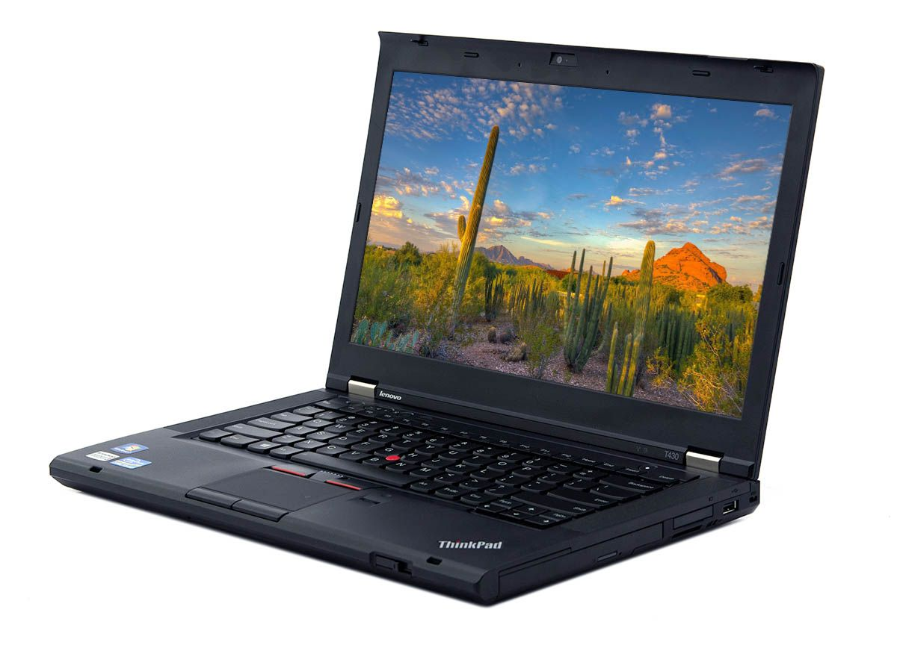

*Lenovo ThinkPad T430*

But the spec sheet alone doesn’t tell the full story of this machine. Like the Land Cruiser, the T430 was designed to take years of use and abuse in just about any environment you throw at it. Its thick magnesium-reinforced chassis and utilitarian plastics result in a total weight of nearly five pounds—monstrous by modern laptop standards. Both machines treat longevity as a first-class feature, a philosophy that’s increasingly rare these days.

In the rest of this article, I’ll dive into my experience repairing, modifying, and daily-driving this 14-year-old laptop, and dig into why these old ThinkPads still inspire such a loyal following.

## A Brief History of ThinkPad

Created by IBM in the mid-1990s, ThinkPad computers have long been a staple in the enterprise world. Early ThinkPads were excellent machines, but after failing to achieve mass-market adoption, IBM sold its computer division to Lenovo in 2005. Lenovo hit the ground running with the launch of the ThinkPad T60 (pictured below) in 2006—the first ThinkPad released under Lenovo’s leadership and the first widely successful model of the Lenovo era. [1]

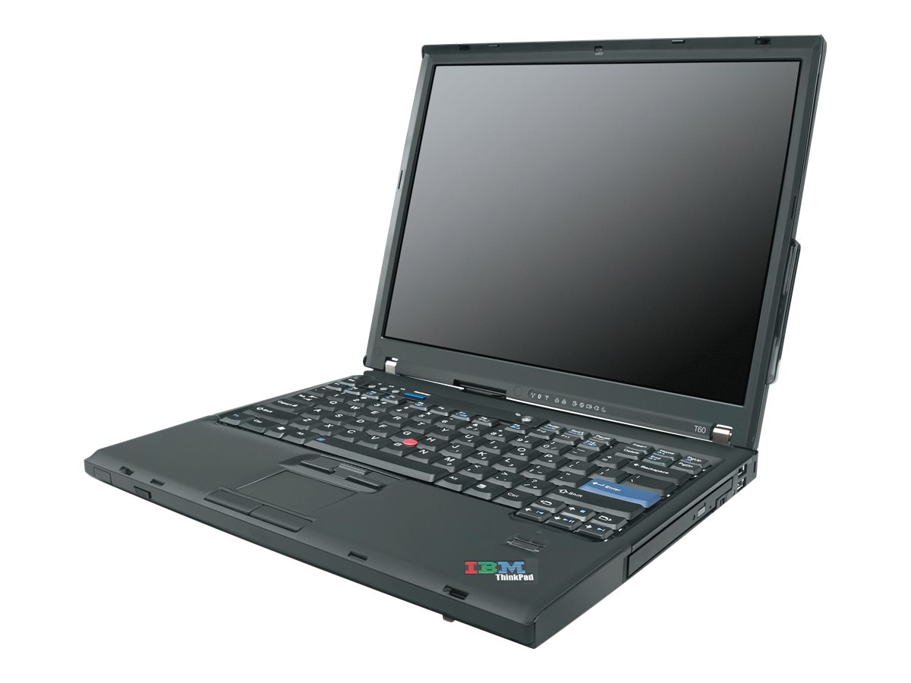

*ThinkPad T60*

From the mid-2000s through the mid-2010s, Lenovo preserved ThinkPad’s durable and repairable design philosophy. Capitalizing on the success of the T60, Lenovo released the X60 in 2007, which was essentially a compact version of the T60. In 2008, the T60 and X60 were replaced with the T400 and X200, respectively. These two models would go on to shape the ThinkPad brand for years to come.

Some purists argue that modern ThinkPad models have drifted from their roots as durable, function-first machines, similar to the 2024 Land Cruiser. [2] As a result, there’s a lot of online discussion about what was the “last great ThinkPad.” Some neckbeards draw the line all the way back at the T60, while others argue that the T480 (released in 2018) is still a solid choice. Regardless, I think it’s safe to say that most, if not all, ThinkPad models—even the modern ones—remain some of the most serviceable machines on the market.

## Why T430?

I got the itch to get my hands on an old ThinkPad after the YouTube algorithm served me [a video from Luke Smith](https://www.youtube.com/watch?v=La3sb5y7e-k), in which he talked about his experience with multiple older ThinkPad models. After immersing myself in ThinkPad lore for several days, I knew I had to get one. 

From my research, I think the main reason these machines have such a devout following is that they have something for every kind of nerd. Are you a Linux user? ThinkPads have an excellent track record for Linux support. Do you want open-source firmware? You’re in luck! Many models support coreboot and/or Libreboot. Want to upgrade your machine? There's a thriving online community of ThinkPad modders and a plentiful supply of parts available. On a budget? Many models can be had for less than $100 on the used market.

Ultimately, I landed on the T430 because it’s new enough to support modern(ish) hardware while also retaining the old-school ThinkPad styling and legendary build quality. I had planned for this laptop to replace my Surface Book 2 as my daily driver, so I needed something I could actually use day to day—not a museum piece. I picked mine up on eBay for $150. That’s a bit on the high end, but the machine was in excellent condition and included the original charger.

Time for some upgrades!

*Upgrades, people. Upgrades.*

## RAM, Storage, and Linux

First up were the low-hanging fruit: RAM and storage. My T430 came with a spinning hard drive and 8GB of RAM. I didn’t record the original boot time, but it routinely took over a minute to load Windows 10, which came preinstalled.

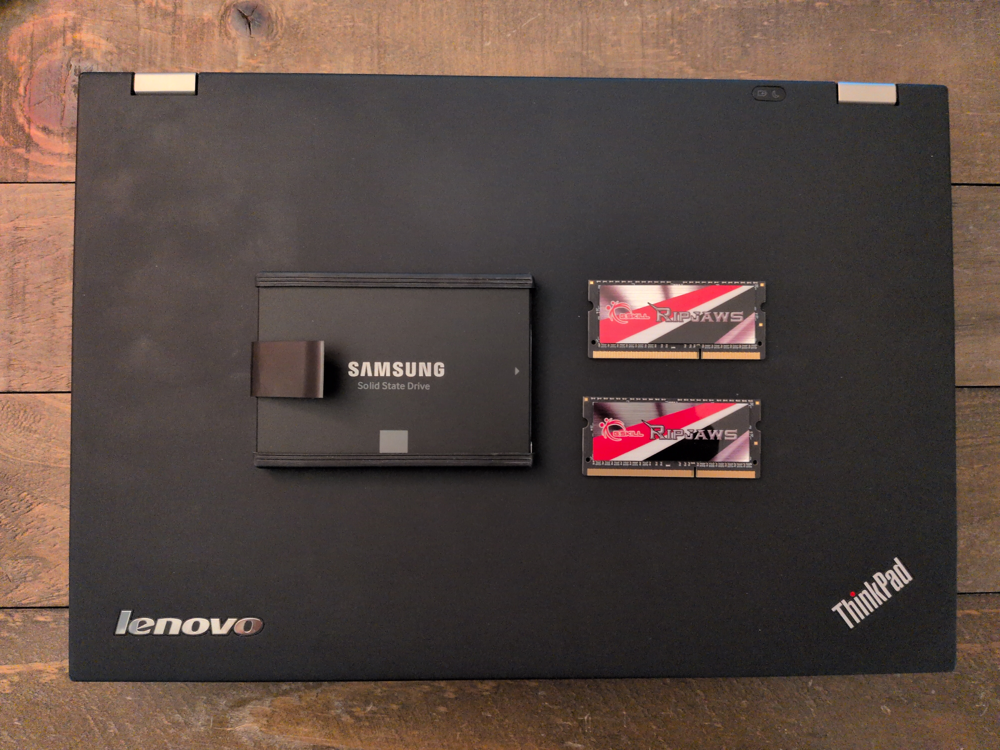

I replaced the hard drive with a Samsung SSD and upgraded to a 16GB G.Skill memory kit. I also ditched Windows in favor of Arch Linux, along with a [custom rice I wrote about last month](https://noahhefner.github.io/website/posts/linux-desktop/). With the SSD and a *superior* operating system, the machine now boots in about 10 seconds.

## 7-Row Keyboard Mod

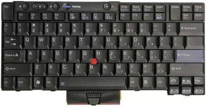

*7 Row T420 Keyboard*

The ThinkPad xx30 series replaced the iconic beveled keyboard with a more modern island-style design. Reception to this change was mixed, with some reviewers praising the new keyboard while others lamented the loss of the classic 7-row layout. One popular mod among T430 owners is swapping the stock keyboard for a T420 keyboard to restore the older design. This modification requires altering the T420 keyboard in several places, as it is not an exact fit.

I found the mod interesting, so I ordered a T420 keyboard and installed it by following [this guide](https://www.instructables.com/ThinkPad-T430T430sX230-Classic-Keyboard-Mod/). The process went smoothly, and I had the new keyboard working without any issues.

After using it for about two weeks, I realized I actually prefer the island-style keyboard. Maybe I’m just too young to fully appreciate the classic design; I think the island-style keyboard is great. Thankfully, this mod is reversible, and I got the stock keyboard reinstalled in about five minutes.

## Screen Upgrade

A sore spot on many ThinkPad models is the display, and the T430 is no exception. The stock display is absolute garbage. It’s a TN panel with some of the worst viewing angles I’ve ever seen on a laptop.

Fortunately, someone discovered that the panel from a Dell Alienware M14x can be swapped in with no additional hardware or software modifications. The Alienware panel has the same resolution as the stock display but offers vastly improved viewing angles and color reproduction.

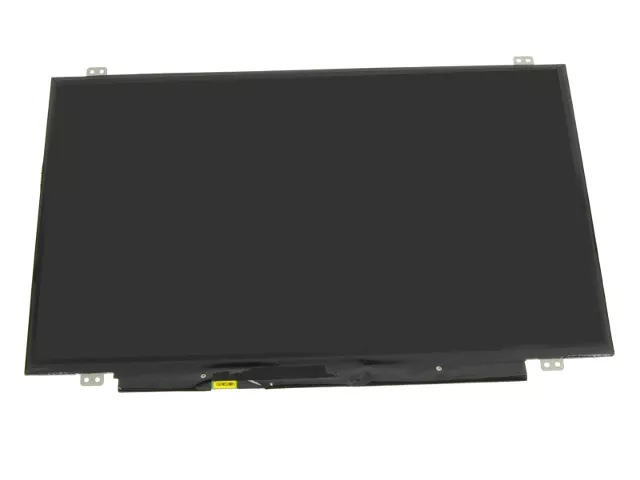

There are ways to install a 1080p panel, but doing so requires a shady adapter from eBay, which reportedly can cause screen flickering on some machines. Since I was happy with the stock 1600x900 resolution, I decided to play it safe and stick to the Alienware panel.

## Firmware Modifications

Many ThinkPad enthusiasts choose to flash their systems with an open-source firmware called [coreboot](https://www.coreboot.org/). coreboot (yes, that is the [correct spelling](https://doc.coreboot.org/index.html#spelling-of-coreboot)) replaces the stock firmware and offers several advantages. Because it’s entirely open source, there’s increased transparency into the code running at one of the most privileged levels of the system. Boot times are also improved, as coreboot is leaner than the stock firmware.

Perhaps the biggest advantage, however, is the removal of the hardware whitelist baked into the stock T430 UEFI. This whitelist prevents the system from booting if a third-party battery or wireless card is installed. Removing it allows the use of aftermarket batteries and modern Wi-Fi cards.

It’s worth noting that coreboot alone is not a replacement for the stock UEFI. coreboot simply initializes the hardware and then hands control to a payload stored in the firmware. The payload is what actually contains your UEFI or BIOS implementation. The two most popular options are [SeaBIOS](https://github.com/coreboot/seabios) and [edk2](https://github.com/tianocore/edk2), which are open-source implementations of the legacy PC BIOS and the newer UEFI specification, respectively.

Another popular firmware modification is [me_cleaner](https://github.com/corna/me_cleaner). To understand its purpose, you first need to understand the [Intel Management Engine](https://en.wikipedia.org/wiki/Intel_Management_Engine), or IME. IME is a proprietary microcontroller present on all post-2006 Intel platforms that operates independently of the main CPU and operating system.

IME enables features such as Intel Active Management Technology (AMT), Intel Boot Guard, and Intel Protected Audio Video Path (PAVP). To function, it requires deep system access, including direct memory access (DMA) and network connectivity, transparent to the user. While IME has legitimate **enterprise** use cases, it has raised significant security and privacy concerns within the open-source community. [3]

me_cleaner is a tool for neutering IME on Intel-based machines. IME cannot be removed completely due to its tight integration with the boot process, but it can be modified such that it is active **only** during the boot process, effectively disabling it during normal operation.

For the ThinkPad xx30 series, there’s a project called [Skulls](https://github.com/merge/skulls), which bundles all the tools needed to install coreboot with SeaBIOS and apply me_cleaner. It’s essentially a one-stop shop for all the popular firmware mods on xx30 ThinkPads.

*Skulls Logo*

Flashing the firmware requires fully disassembling the machine to access two ROM chips on the underside of the motherboard. A CH341A programmer or a Raspberry Pi can then be used to flash the firmware. Skulls simplifies the process by abstracting away all the complexity of backing up the stock UEFI, running me_cleaner, and flashing coreboot with SeaBIOS into just two Bash scripts.

*T430 completely disassembled*

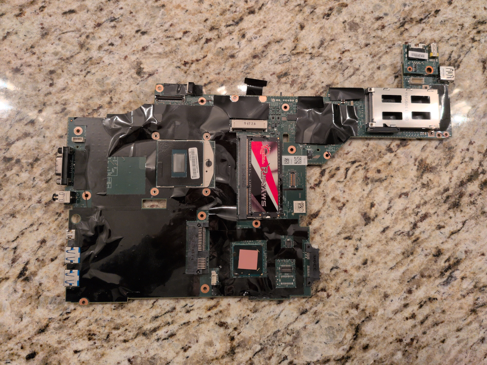

*Naked T430 motherboard*

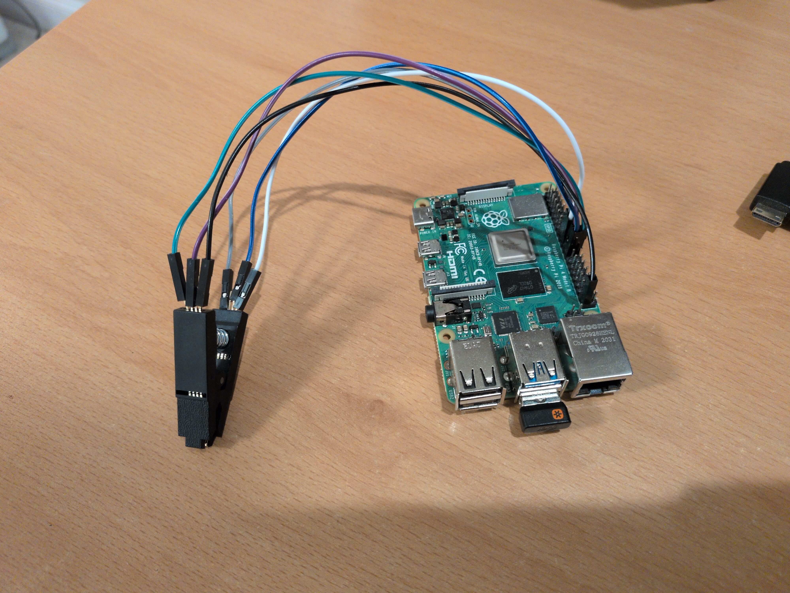

*Raspberry Pi*

I was a bit intimidated by the idea of tearing apart my entire system to access the ROM chips. To stay organized, I took photos and recorded every single screw I removed in my notebook, making sure none were missed during reassembly. I’m very glad I did, because I don’t think I would have been able to put it back together without those references.

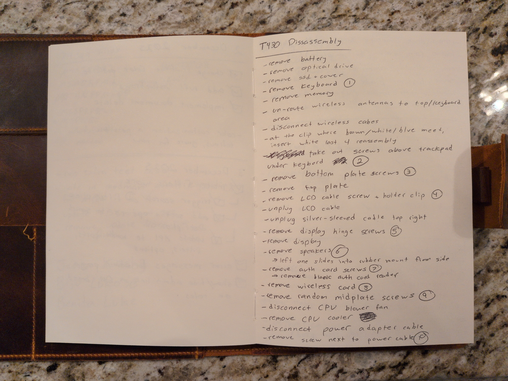

*Disassembly notes*

Skulls is by far the easiest way to get coreboot installed on the T430. But it is configured with SeaBIOS, which implements the older BIOS standard instead of the newer UEFI standard. For my T430, I wanted to use edk2 instead of SeaBIOS, simply because it is a little more user-friendly. Fortunately, Skulls also unlocks the machine so that you can later install a new BIOS/UEFI through software via the `flashrom` utility instead of tearing the machine apart all over again. After reassembling the laptop and making sure everything still worked, I used the scripts from [this repository](https://github.com/Thrilleratplay/coreboot-builder-scripts) to compile a new coreboot image with edk2 instead of SeaBIOS. I then used `flashrom` to flash this new edk2 image to my motherboard.

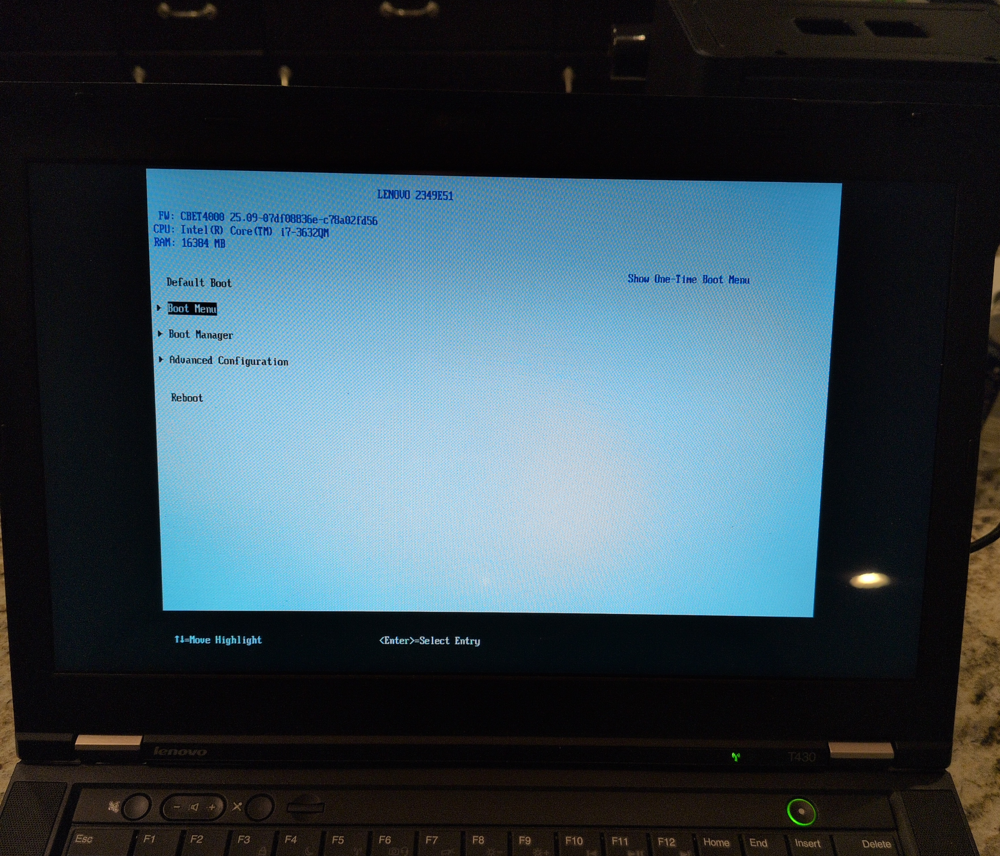

*edk2 UEFI*

## CPU Upgrade

The T430 has a socketed CPU, which is incredibly rare for laptops. The T430 can accept any [G2](https://en.wikipedia.org/wiki/Socket_G2) socketed CPU. I selected the i7–3632QM, a quad-core, 8-thread Ivy Bridge series processor. This is not the highest-performance chip that is compatible with the T430, but it is the highest-performing compatible chip with a 35-watt TDP. The T430 can technically support higher wattage chips like the i7–3840QM (45 watt TDP) or even the i7–3940XM (55 watt TDP), but I would rather have the power savings than the extra performance.

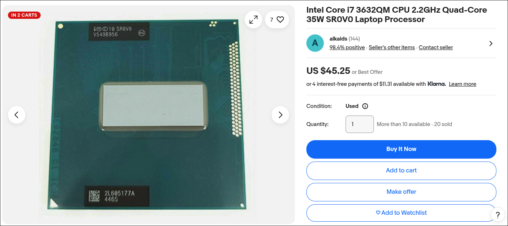

*i7–3632QM CPU*

## Wireless Card and Battery Upgrade

With coreboot installed and the whitelists removed, I could now install a modern wireless card and an aftermarket battery. I selected the [MPE-AX3000H](https://www.amazon.com/MPE-AX3000H-802-11ac-Wireless-Express-Network/dp/B091FJXQHH), which supports Wi-Fi 6 and Bluetooth 5.2. This is a massive upgrade over the stock Intel Centrino Advanced-N 6205, which doesn't even support 802.11ac.

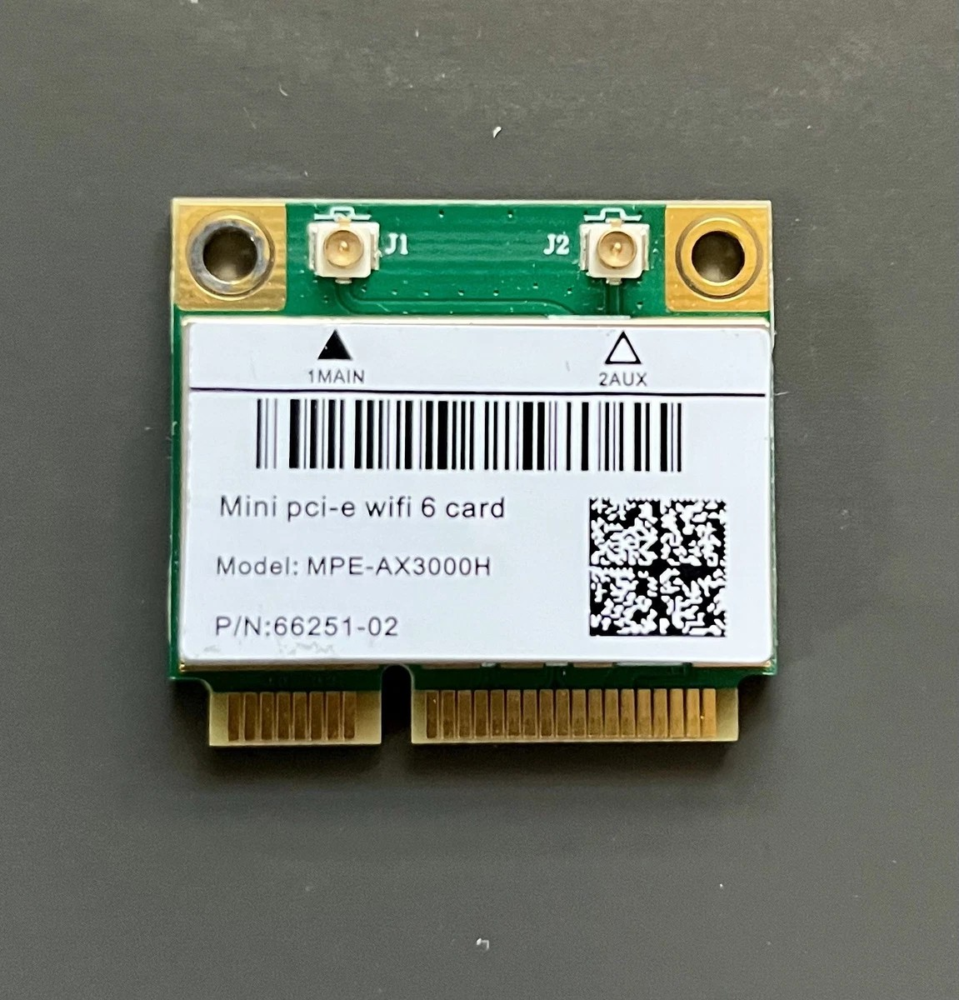

*MPE-AX3000H Wireless Chip*

From my research online, aftermarket ThinkPad batteries can be really hit or miss. I opted for [this Xtend brand 9-cell pack](https://www.laptopbatteryexpress.com/Lenovo-ThinkPad-70-9-Cell-Battery-p/len-707xt.htm) from [LaptopBatteryExpress.com](https://www.laptopbatteryexpress.com/). Xtend (allegedly) uses high quality battery cells from Samsung, though I'm not going to crack my unit open to verify that claim. Since this pack contains three additional cells compared to the standard 6-cell pack, it protrudes from the back of the laptop a fair bit, but it will also last much longer between charges.

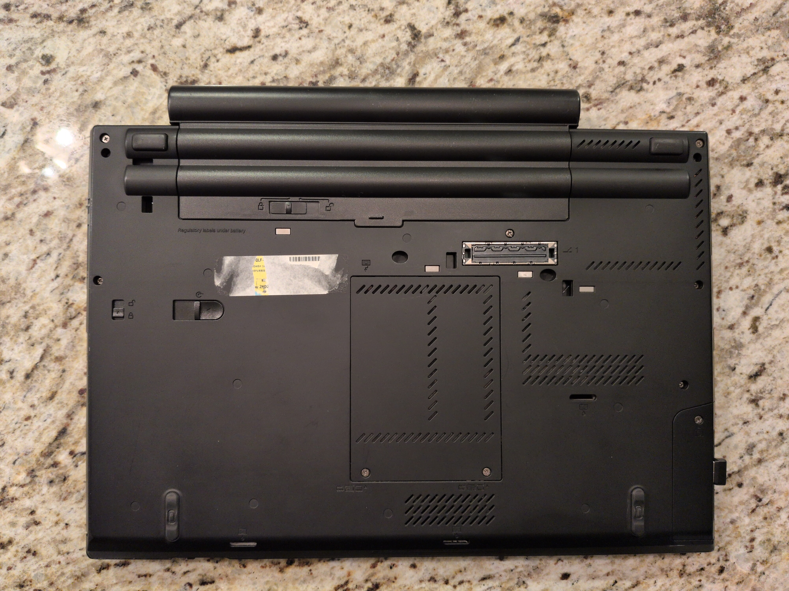

*9-cell battery*

Aside from the SSD, these two upgrades have had the biggest impact on the day-to-day usability of the machine. I can finally use it for more than 30 minutes away from the wall and the download speeds are absolutely incredible. Time will tell if the battery holds up; I was just happy to see that there are still aftermarket options available at all!

## Touchpad Button Repair

The only repair I made to my T430 was replacing the bottom trackpad buttons. The stock buttons functioned fine, but it appeared that the previous owner had spilled some sort of liquid into them, and they sometimes stuck to the chassis when pressed. I ordered the replacement buttons from Amazon for just $4 and swapped them in. No more sticky buttons!

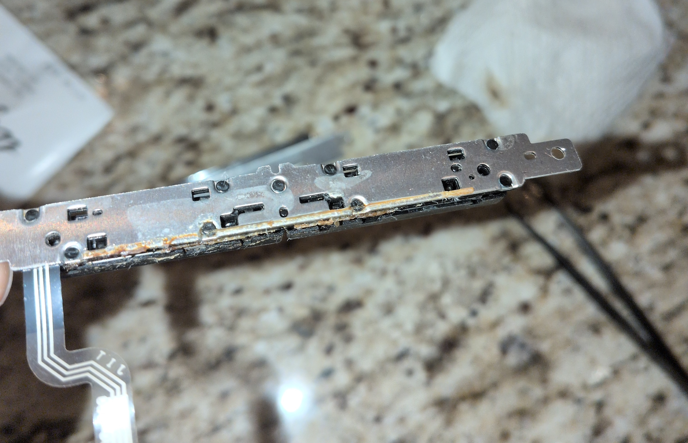

*Old Touchpad Buttons*

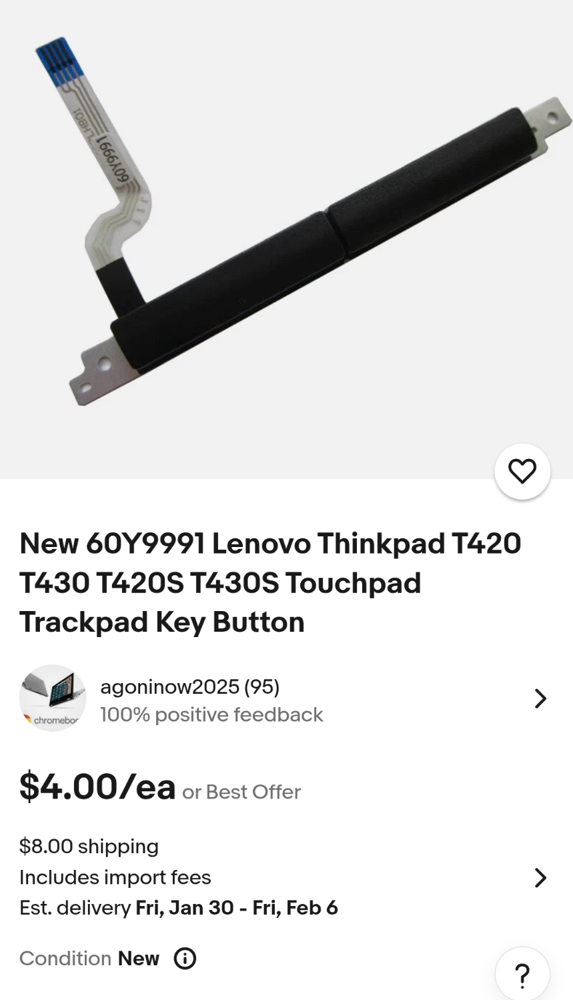

*New Touchpad Buttons*

## CMOS Replacement

I don't know if the previous owner ever replaced the CMOS battery on my T430, so I decided to do some preventative maintenance and put in a new one since the machine is over a decade old.

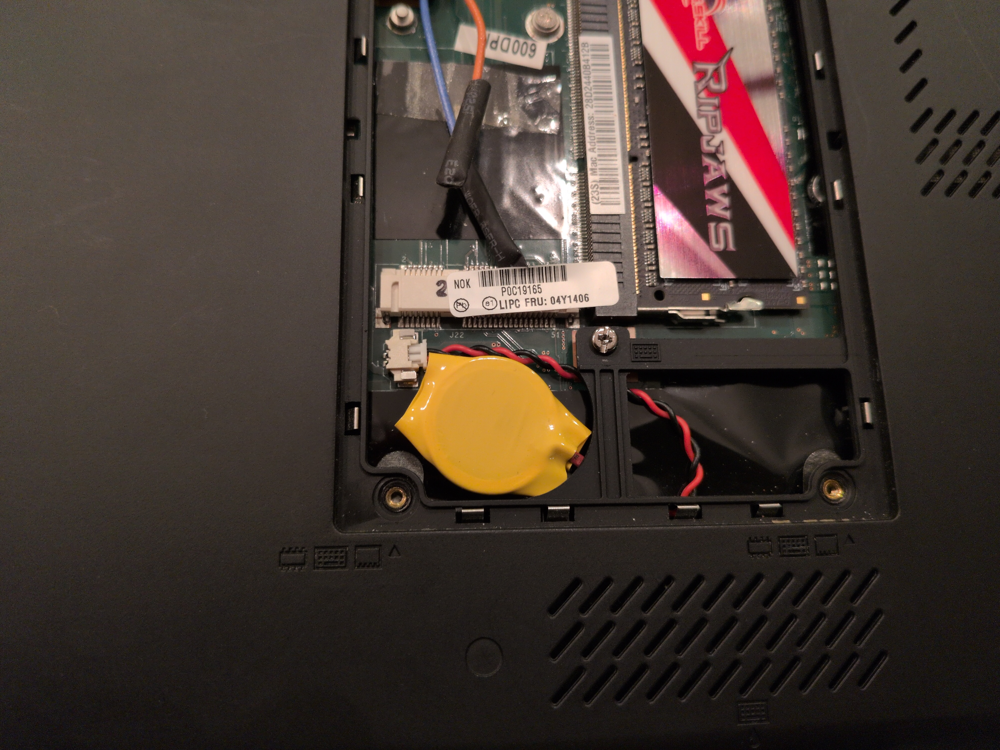

## Future Plans

There's one final mod that I might do in the future. I found a Tindie seller who makes [3D-printed USB Type-C charging port drop-in replacements](https://www.tindie.com/products/mikepdiy/charging-port-type-c-lenovo-pd-t420-t430/) for the T430. This mod would allow me to charge the T430 using the same USB Type-C charger that I already have for all my other devices.

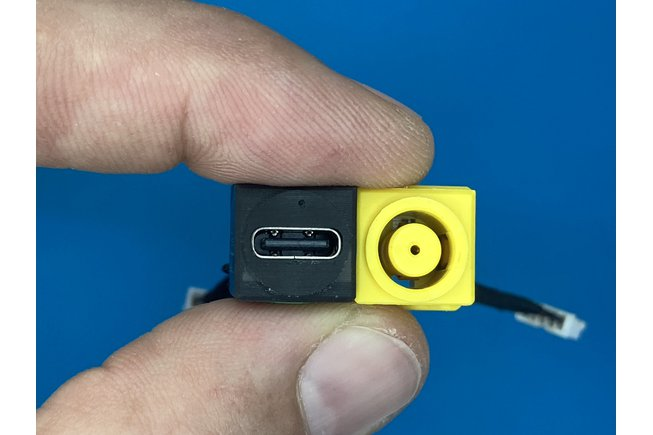

*USB Type-C Charge Port for the T430*

## Conclusion

*My modded ThinkPad T430*

I absolutely love my T430. I appreciate all the tactile elements of the machine, like the physical latch that keeps the lid closed, the wireless kill switch, and the CD drive that pops out at the press of a button. I especially enjoy the ThinkLight—a small LED next to the webcam that shines directly onto the keyboard. It’s a simple, elegant solution for typing in dark environments.

There are so many other thoughtful touches throughout the machine. Small LEDs on the back of the display indicate when the laptop is sleeping or charging while the lid is closed. The USB ports on the left side are recessed, allowing a wireless mouse dongle to remain plugged in without awkwardly protruding from the chassis. The battery is hot-swappable, enabling extended usage sessions—if you’re willing to lug around a second one. This level of attention to detail and well-considered design makes the T430 a joy to use every day.

The process of modifying, customizing, and upgrading the machine has been both fun and rewarding. There’s a unique sense of accomplishment in reviving an old piece of hardware and breathing new life into a machine that most people would consider obsolete. I take pride in knowing my machine inside and out and having the confidence to repair it and maintain it for years to come.

## Sources

1. [THINK: A brief history of ThinkPads, from IBM to Lenovo](https://www.notebookcheck.net/THINK-A-brief-history-of-ThinkPads-from-IBM-to-Lenovo.418728.0.html)
2. [What was the last truly great Thinkpad?](https://www.reddit.com/r/thinkpad/comments/p47j37/what_was_the_last_truly_great_thinkpad/)
3. [Intel Management Engine - Wikipedia](https://en.wikipedia.org/wiki/Intel_Management_Engine)