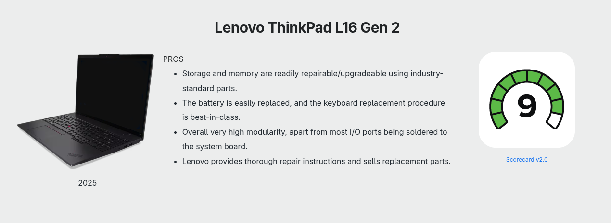
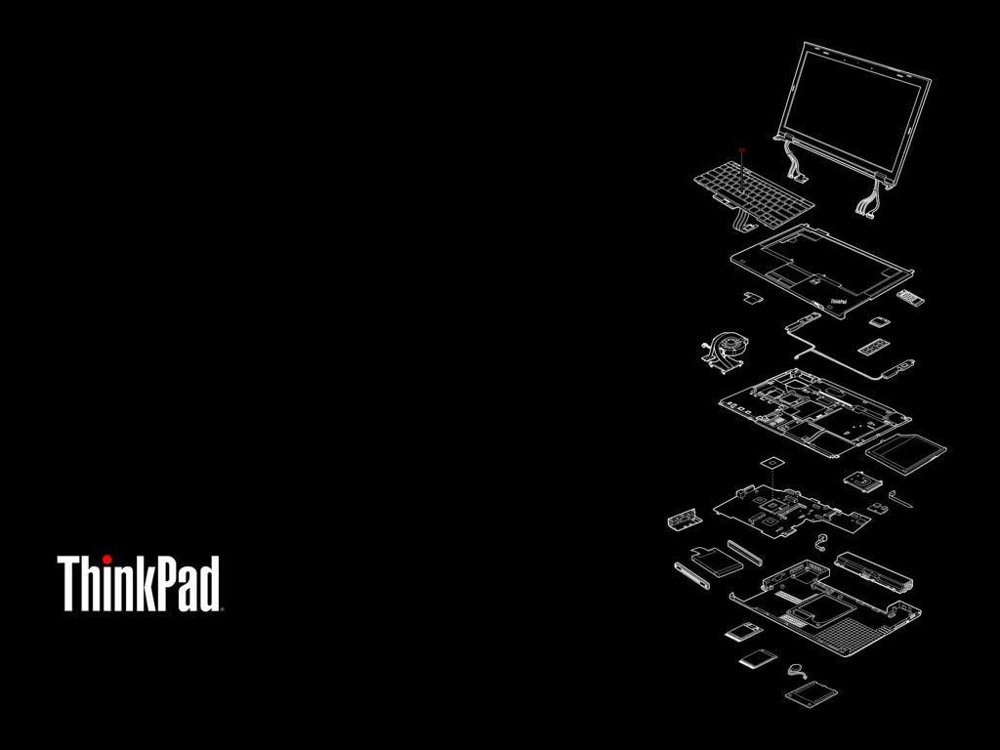

Produced from 1999 through 2007, the 100 Series Toyota Land Cruiser is arguably one of the toughest vehicles ever made. It’s not uncommon to see 100 Series Land Cruisers still on the road today with well over 200,000 miles on the odometer—and still going strong. This longevity comes from durable yet simple construction. The 100 Series features body-on-frame architecture, a solid rear axle, and the legendary 4.7-liter 2UZ-FE—often cited as one of the most reliable engines Toyota has ever produced.

Inside the cabin, you won’t find modern conveniences like push-button start, touchscreen navigation, lane-keep assist, or even a backup camera. But what it lacks in creature comforts, the 100 Series more than makes up for with a design philosophy that prioritizes function over flash.

*100 Series Toyota Land Cruiser*

After daily driving a 100 Series for over five years, I developed a deep appreciation for machines that value durability over novelty. That same philosophy is what led me to the machine currently sitting in my lap: a Lenovo ThinkPad T430. Released in 2012 and aimed at business users, the T430 is not a modern machine by any measure. Typical of early-2010s business laptops, the T430 includes a dual-core Ivy Bridge processor, 8GB of DDR3 memory, a spinning hard drive, a barely passable webcam, and what might be the worst laptop screen ever produced.

*Lenovo Thinkpad T430*

What makes this machine special, however, isn’t the spec sheet—it’s how unapologetically overbuilt and straightforward it is. The T430 was designed for years of daily use in corporate environments, not for chasing the latest tech trends. Its thick magnesium-reinforced chassis and utilitarian plastics favor reliability over thinness or flair. 

In many ways, the T430 is the Land Cruiser of laptops. It’s built like an absolute tank, weighing nearly five pounds—monstrous by today’s standards. Like the Land Cruiser, it has an almost cult-like following of die-hard fans. It won’t turn heads in a coffee shop unless you know what you’re looking at. Both machines were designed with longevity as a feature, not a byproduct—a philosophy that’s increasingly rare.

In the rest of this article, I’ll dive into my experience daily-driving, repairing, and modifying my T430, and explain why these old ThinkPads continue to inspire such a loyal following.

## Why the T430?

Created by IBM in the mid-1990s, ThinkPad computers have long been a staple in the enterprise world. Early ThinkPads were excellent machines, but after failing to achieve mass-market adoption, IBM sold its computer division to Lenovo in 2005. Lenovo hit the ground running with the launch of the T60 in 2006—the first ThinkPad released under Lenovo’s leadership and the first widely successful model of the Lenovo era. [1]

*ThinkPad T60*

In those early years, Lenovo preserved ThinkPad’s function-over-form, durable, and repairable design philosophy, earning a well-deserved reputation for reliability.

However, much like how the newest Land Cruiser has drifted from its roots as a simple, rugged truck, some ThinkPad purists argue that modern ThinkPads have strayed from their origins as function-first workhorse machines. [2] This criticism is partly justified—modern ThinkPads don’t feel quite as solid or “tanky” as their older counterparts. That said, I think much of the criticism towards the newer models is undeserved.

Modern ThinkPads remain among the most repairable laptops on the market. Lenovo provides excellent documentation and repair guides for all of its machines, and even many 2025 models—such as the ThinkPad L16 Gen 2—still feature replaceable storage, RAM, and batteries.

*iFixit Repairability Score*

While I’m sure modern ThinkPads are great machines, I was drawn to the classic ThinkPad durability and aesthetic. That said, I still wanted something practical and new enough to run modern software comfortably, not a museum piece. Ultimately, I landed on the xx30 generation—specifically the T430—for the following reasons:

1. **Skulls** – Skulls is a project that makes it easy to flash any xx30-series ThinkPad with coreboot, an open-source firmware that supports a wide range of devices. More on this later.
2. **Community Support** – There is a wealth of online content dedicated to modding and upgrading the T430.
3. **Repairability and Upgradability** – The T430 is very easy to disassemble. All major components—including the CPU—are socketed rather than soldered, making repairs and upgrades straightforward. Parts are readily available from iFixit or the used market.
4. **New Enough** – The xx30 series supports Intel’s Ivy Bridge processors. While not cutting-edge, they still provide solid performance for light to medium workloads. The T430 also supports up to 16GB of DDR3 memory, which is plenty for Linux. (By comparison, the T410—just two generations older—is limited to 8GB.)
5. **Price** – The T430 is relatively inexpensive, typically selling for $50 to $200 on the used market, depending on condition.
6. **USB 3.0** – The xx30 series was the first to include USB 3.0. (The previous xx20 generation is limited to USB 2.0, a compromise I wasn’t willing to make.)

After settling on the T430, I picked one up on eBay for $150. That’s a bit on the high end, but the machine was in excellent condition and included the original charger. 

Time for some upgrades!

## RAM, Storage, and Linux

First up were the low-hanging fruit: RAM and storage. My T430 came with a spinning hard drive and 8GB of RAM. I didn’t record the original boot time, but it routinely took over a minute to load Windows 10, which came preinstalled.

I replaced the hard drive with a Samsung 850 Pro SSD and upgraded to a 16GB G.Skill memory kit. I also ditched Windows in favor of Arch Linux, along with a [custom rice I wrote about last month](https://noahhefner.github.io/website/posts/linux-desktop/). With the SSD and a lighter operating system, the machine now boots in about 10 seconds.

## Screen Upgrade

A sore spot on many ThinkPad models is the display, and the T430 is no exception. The stock display is absolute dog water. It’s a TN panel with some of the worst viewing angles I’ve ever seen on a laptop.

Fortunately, someone discovered that the panel from a Dell Alienware M14x can be swapped in with no additional hardware or software modifications. The Alienware panel has the same resolution as the stock display but offers vastly improved viewing angles and color reproduction.

There are ways to install a 1080p panel, but doing so requires an aftermarket adapter, and some users have reported screen flickering issues after installing it. I opted for the Alienware panel instead—1600×900 is plenty for my needs, and I didn’t want to install a questionable mod just to gain a few extra pixels.

## Firmware Modifications

Many ThinkPad enthusiasts choose to flash their systems with an open-source firmware called [coreboot](https://www.coreboot.org/). coreboot replaces the stock firmware and offers several advantages. Because it’s entirely open source, there’s increased transparency into the code running at the most privileged level of the system. Boot times are also improved, as coreboot is far leaner than the stock firmware.

Perhaps the biggest advantage, however, is the removal of the hardware whitelist baked into the stock T430 BIOS. This whitelist prevents the system from booting if a third-party battery or wireless card is installed. Removing it allows the use of aftermarket batteries and modern Wi-Fi cards.

It’s worth noting that coreboot does not completely replace the BIOS or UEFI. Instead, coreboot initializes the hardware and then hands control to a payload stored in firmware. The payload contains your BIOS or UEFI implementation. The two most common options are [SeaBIOS](https://github.com/coreboot/seabios), an open-source implementation of the legacy PC BIOS API, and [edk2](https://github.com/tianocore/edk2), an open-source UEFI firmware development environment.

Another popular firmware modification is [me_cleaner](https://github.com/corna/me_cleaner). To understand its purpose, you first need to understand the [Intel Management Engine](https://en.wikipedia.org/wiki/Intel_Management_Engine) (IME). IME is a proprietary microcontroller present on all post-2006 Intel platforms that operates independently of the main CPU and operating system.

IME enables features such as Intel Active Management Technology (AMT), Intel Boot Guard, and Intel Protected Audio Video Path (PAVP). To function, it requires deep system access, including direct memory access (DMA) and network connectivity. While IME has legitimate enterprise use cases, it has raised significant security and privacy concerns within the open-source community. [3]

On newer systems—including the T430—IME cannot be fully disabled due to its tight integration with the boot process. However, it can be neutered. me_cleaner modifies the IME firmware so that it is active only during the boot process, effectively disabling it during normal operation.

For the ThinkPad xx30 series, there’s a project called [skulls](https://github.com/merge/skulls), which bundles all the tools needed to install coreboot with SeaBIOS and apply me_cleaner. It’s essentially a one-stop shop for all the popular firmware mods on xx30 ThinkPads.

Flashing the firmware requires fully disassembling the machine to access two ROM chips on the underside of the motherboard. A CH341A programmer or a Raspberry Pi—what I used—can then be used to flash the firmware. Skulls simplifies the process by abstracting away all the complexity of backing up the stock BIOS, running me_cleaning, and flshing coreboot into just two Bash scripts.

*T430 completely disassembled*

*Naked T430 motherboard*

*The Raspberry Pi I used to flash coreboot*

Using Skulls’ build scripts, I compiled coreboot myself so I could set a custom bootsplash image. The bootsplash is simply an image displayed for a few seconds during boot. I found a set of excellent “exploded ThinkPad” wallpapers from [this Reddit post](https://www.reddit.com/r/thinkpad/comments/5ngc8x/exploded_thinkpad_wallpaper_requests), and they were a perfect fit. The OP even created one specifically for the T430!

*Exploded T430 bootsplash image*

I was a bit intimidated by the idea of tearing apart my entire system to access the ROM chips. To stay organized, I took photos and recorded every single screw I removed in my notebook, making sure none were missed during reassembly. I’m very glad I did, because I don’t think I would have been able to put it back together without those references.

picture here of notes

*Disassembly notes*

## 7-Row Keboard Mod

The ThinkPad xx30 series replaced the iconic beveled keyboard with a more modern island-style design. Reception to this change was mixed, with some reviewers praising the new keyboard while others lamented the loss of the classic 7-row layout. One popular mod among T430 owners is swapping the stock keyboard for a T420 keyboard to restore the older design. This modification requires altering the T420 keyboard in several places, as it is not an exact fit.

I found the mod interesting, so I ordered a T420 keyboard and installed it by following [this guide](https://www.instructables.com/ThinkPad-T430T430sX230-Classic-Keyboard-Mod/). The process went smoothly, and I had the new keyboard working without any issues.

After using it for about two weeks, I realized I actually prefer the island-style keyboard. Maybe I’m just too young to fully appreciate the classic design—but I’ve come to think the island-style keyboard is pretty great. Thankfully this mod is reversible and I got the stock keyboard reinstalled in about five minutes.

## CPU Upgrade

As I mentioned in the introduction, the T430 has a socketed CPU. This is incredibly rare for laptops. Even the Framework laptop, the bastion of modern repairable laptops, has a soldered CPU. There are a handful of processors that can be used in the T430. I selected the i7–3632QM, a quad-core, 8 thread, 35 watt chip which should offer a nice performance boost over the dual-core i5-3320M chip that came with my machine.

## Wireless Card Upgrade

With coreboot installed and the whitelist removed, I could now install a modern wireless card. I selected the MPE-AX3000H which supports Wi-Fi 6 and Bluetooth 5.2.

## Touchpad Button Repair

The only repair I made to my T430 was replacing the bottom trackpad buttons. The stock buttons functioned fine, but it appeared that the previous owner had spilled some sort of liquid into them and they sometimes would stick to the chasis when pressed. I ordered the replacement buttons off of Amazon for just $4 and swapped them in. No more sticky buttons!

## CMOS Replacement

I don't know if the previous owner ever replaced the CMOS battery on my T430, so I decided to do some preventative maintenance and put in a new one since the machine is over a decade old.

## Conclusion

I absolutely love my T430. I appreciate all the tactile elements of the machine, like the physical latch that keeps the lid closed, the wireless kill switch, and the CD drive that pops out at the press of a button. I especially enjoy the ThinkLight—a small LED next to the webcam that shines directly onto the keyboard. It’s a simple, elegant solution for typing in dark environments.

There are so many other thoughtful touches throughout the machine. Small LEDs on the back of the display indicate when the laptop is sleeping or charging while the lid is closed. The USB ports on the left side are recessed, allowing a wireless mouse dongle to remain plugged in without awkwardly protruding from the chassis. The battery is hot-swappable, enabling extended usage sessions—if you’re willing to lug around a second one. This level of attention to detail and well-considered design makes the T430 a joy to use every day.

The process of modifying, customizing, and upgrading the machine is both fun and rewarding. There’s a unique sense of accomplishment in reviving an old piece of hardware and breathing new life into a machine that most people would consider obsolete. I take pride in knowing my machine inside and out and having the confidence to repair it and maintain it for years to come.

## Sources and Additional Reading

1. [THINK: A brief history of ThinkPads, from IBM to Lenovo](https://www.notebookcheck.net/THINK-A-brief-history-of-ThinkPads-from-IBM-to-Lenovo.418728.0.html)
2. [What was the last truly great Thinkpad?](https://www.reddit.com/r/thinkpad/comments/p47j37/what_was_the_last_truly_great_thinkpad/)
3. [Intel Management Engine - Wikipedia](https://en.wikipedia.org/wiki/Intel_Management_Engine)