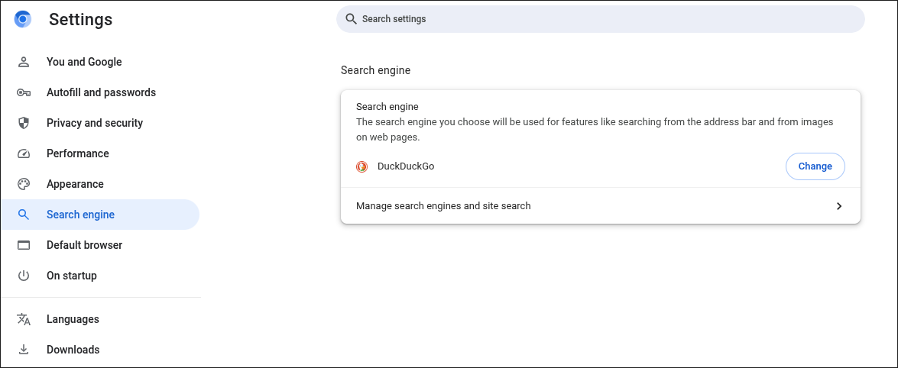
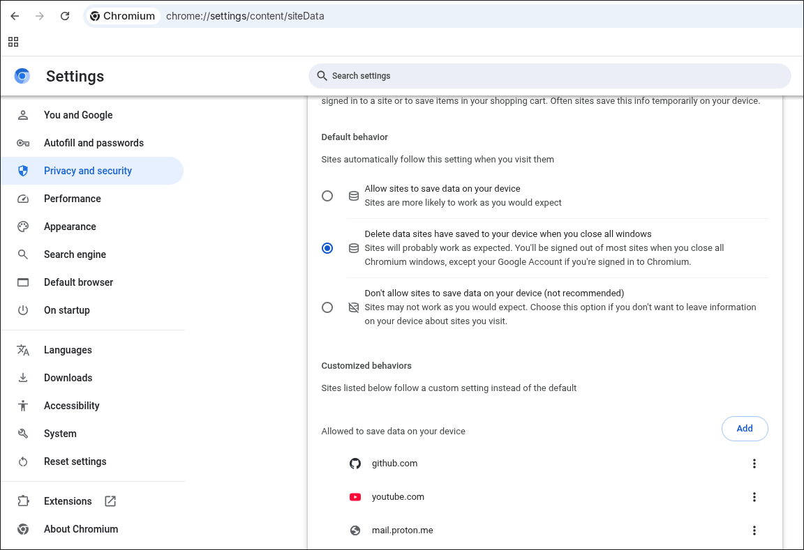

There aren’t many real choices when it comes to web browsers these days. Over the past decade or so, Google Chrome has effectively monopolized the market, with most estimates placing its global market share between [60 and 70 percent](https://radar.cloudflare.com/reports/browser-market-share-2025-q1) globally. In addition to obvious anti-consumer concerns, this is especially unsettling for privacy-conscious individuals, as it leaves much of the modern web shaped by a company whose business model is fundamentally at odds with user privacy.

Privacy-focused browsers do exist, though none of them are perfect. Tor Browser offers strong anonymity at the cost of usability, while projects like [Arkenfox](https://github.com/arkenfox/user.js/) aim to enhance Firefox's security through aggressive configuration. Brave is a Chromium-based option that attempts to balance privacy and convenience, but its built-in cryptocurrency features aren’t for everyone. For the past several years, I’ve enjoyed using [LibreWolf](https://librewolf.net/)—a hardened Firefox fork that provides solid privacy out of the box with minimal setup.

However, after recently running into stability issues with LibreWolf that I couldn’t pin down, I began searching for a new web browser. Suspecting that my problems might be related to the Firefox engine itself, I narrowed my search to Chromium-based browsers. That’s when I discovered [ungoogled-chromium](https://github.com/ungoogled-software/ungoogled-chromium).

ungoogled-chromium is fantastic, but it does require some tweaking to be usable as a day-to-day browser. In this article, I’ll walk through my experience installing and configuring this browser, turning it into a viable daily driver.

## Disclaimer on Privacy

There are a few places throughout this post where I touch on online privacy. To be very clear: I am not an expert in web browser technologies or online privacy, and it is not my intention to persuade everyone who reads this post that ungoogled-chromium, or any specific browser, is the right choice for them.

“Privacy” is an ill-defined term that can mean very different things depending on who you ask. Digital privacy exists on a wide spectrum and extends far beyond your choice of web browser alone. The decisions you make to protect your privacy depend heavily on your personal threat model, priorities, and tolerance for inconvenience. What feels reasonable and necessary for one person may be excessive or impractical for another.

Without taking extreme measures, it is effectively impossible to achieve complete online anonymity. For the everyday person with real-world responsibilities, pursuing every possible method of obscuring online activity is neither realistic nor sustainable. Privacy, in practice, is often about making informed trade-offs rather than striving for absolute perfection.

All that said, the opinions outlined in this article are my own and reflect my personal stance on digital privacy.

## What Is Ungoogled Chromium?

[Chromium](https://www.chromium.org/chromium-projects/) is an open-source web browser project developed by Google that serves as the foundation for many popular browsers, including Google Chrome, Microsoft Edge, Brave, and Opera. ungoogled-chromium (which I will refer to as UC from here onwards) is a fork of the Chromium browser that attempts to eliminate the browser's dependence on Google’s web services where possible, focusing on privacy and minimizing data collection while maintaining the core functionality of Chromium.

The [UC GitHub repository](https://github.com/ungoogled-software/ungoogled-chromium?tab=readme-ov-file#motivation-and-philosophy) sums up the purpose and motivation of the project nicely:

*Without signing in to a Google Account, Chromium does pretty well in terms of security and privacy. However, Chromium still has some dependency on Google web services and binaries. In addition, Google designed Chromium to be easy and intuitive for users, which means they compromise on transparency and control of internal operations.*

*ungoogled-chromium addresses these issues in the following ways:*

1. *Remove all remaining background requests to any web services while building and running the browser*
2. *Remove all code specific to Google web services*
3. *Remove all uses of pre-made binaries from the source code, and replace them with user-provided alternatives when possible.*
4. *Disable features that inhibit control and transparency, and add or modify features that promote them (these changes will almost always require manual activation or enabling).*

Point number four is especially interesting. UC adds a wide range of privacy and transparency options that are unavailable in stock Chromium, giving users greater insight into the browser’s behavior. Some of these options are actually borrowed from other browsers, such as Bromite and Iridium. This level of granularity is fantastic for fine-tuning privacy preferences, as UC places control back in the user’s hands rather than relying on Google’s defaults.

Another key selling point for me personally is the complete lack of bloatware in UC. There are no third-party integrations, AI assistants, or cryptocurrency wallets fighting for your attention. It’s a bare-bones piece of software with a singular purpose: allowing the user to access the internet on their own terms, without unnecessary intrusions.

## Customization

Configuring UC to be convenient enough for daily use without compromising on privacy and security requires a fair amount of manual setup. The following sections outline the configuration changes I made to build a functional and private web browsing environment.

### Setting A Search Engine

Consistent with its goal of maximizing user control, UC intentionally ships without a default search engine configured. You need to manually set one in the applications settings, or else the search bar won’t work properly. I’m a DuckDuckGo user, so that’s what I went with.



### Adding Extension Support

Another feature you will find missing from UC is Chrome extensions. Technically you can still install exentions, but additional setup is needed. I don’t use Chrome extensions extensively, but I do like to install uBlock for ad blocking and Bitwarden for quick access to my passwords.

Setting up support for Chrome extensions is pretty straightforward and well documented in the UC wiki. There is a project called [chromium-web-store](https://github.com/NeverDecaf/chromium-web-store), which makes the process very easy.

### Configuring Automatic Data Deletion + Exceptions

A great way to reduce targeted advertisements and prevent websites from tracking your activity is to regularly clear your browser’s cookies. Out of the box, UC already blocks all third-party cookies, which are commonly used by advertisers and analytics providers for cross-site tracking. The LibreWolf browser takes this a step further by automatically clearing all cookies and site data every time you close the application by default. This is great from a privacy perspective, but a nightmare for usability.

Since cookies are often used to store authentication data, leaving this setting enabled means you need to reauthenticate every time you check your email or make an Amazon purchase. This is simply not practical for most people, especially if you use two-factor authentication.

When you think about it, there’s probably only a handful of sites where you actually want to stay logged in. For a few personal examples, I always want to be logged into my Proton account, YouTube, and GitHub. I use all of these services every single day. Additionally, they all require a physical hardware token to access and I’m not going to go through that song and dance every morning.

Fortunately, LibreWolf allows you to whitelist websites where you need to persist data across browser restarts. UC also has this feature, but it isn’t enabled by default. To set it up, navigate to `chrome://settings/content/siteData` and enable “Delete data sites have saved to your device when you close all windows.” Then, under “Allowed to save data on your device,” add the domains you want to whitelist.



## Installing Widevine

Finally, I needed to make a controversial modification to UC: installing [Widevine](https://developers.google.com/widevine/drm/overview). For the uninitiated, Widevine is a proprietary digital rights management (DRM) system from Google that runs in the web browser as an opaque binary blob with the stated goal of “provid[ing] the best experience for viewing premium content over digital distribution.” Essentially, it’s a bit of software that streaming platforms use to prevent people from pirating their content.

Almost every major streaming platform, including music streamers like Spotify and even YouTube livestreams, require Widevine to be installed to function properly. Now, I recognize that installing Widevine goes directly against the values outlined in the previous paragraphs. But the way I see it, Widevine is unfortunately a necessary evil and installing it is a compromise that I’ve decided to accept.

The reccommended method for installing Widevine for UC (on Linux) involves downloading the Google Chrome `.deb` package, extracting the Windevine binary, then moving it to the correct directory on your machine. The UC [wiki](https://ungoogled-software.github.io/ungoogled-chromium-wiki/faq#how-do-i-install-widevine-cdm) even provides a bash script to automate this process. The devs recommend that you install Widevine from the same major version of Google Chrome as your installed version of UC, so its important to remember to also update Widevine when updating UC.

To automate the process of keeping Widevine in sync with my UC install, I took the logic from the UC devs' bash script and integrated it into another script I had that updates all the packages on my system. The script checks and stores the currently installed version of UC, updates all the packages on my system, then checks again after all available updates have been installed to see if UC was updated to a newer version. If so, the script will then download and install Windevine from the matching version of Google Chrome.

```bash
#!/usr/bin/env bash

set -uo pipefail

FAILED=0

pause() {
    echo
    read -n1 -rsp "Press any key to close this window…"
    echo
}

echo "========================================"
echo " Arch Linux System Update"
echo "========================================"
echo
echo "This will update:"
echo "  • Arch Linux packages (pacman)"
echo "  • AUR packages (yay / paru)"
echo "  • Flatpak packages"
echo "  • Chromium Widevine (if Chromium updates)"
echo

read -rp "Do you want to start the system update? [y/N] " confirm
case "$confirm" in
    [yY]|[yY][eE][sS]) ;;
    *)
        echo
        echo "Update cancelled."
        pause
        exit 0
        ;;
esac

# Ensure we are not root
if [[ $EUID -eq 0 ]]; then
    echo "❌ Do not run this script as root."
    pause
    exit 1
fi

# Ensure sudo is available
if ! sudo -v; then
    echo "❌ This script requires sudo privileges."
    pause
    exit 1
fi

# ---------------------------
# Step 0: Detect Chromium version before updates
# ---------------------------
chromium_pre=""
if command -v chromium &>/dev/null; then
    chromium_pre=$(chromium --version 2>/dev/null | awk '{print $2}')
fi

# ---------------------------
# Step 1: Update pacman packages
# ---------------------------
echo "📦 Updating pacman packages..."
if ! sudo pacman -Syu --noconfirm --needed; then
    echo "❌ pacman update failed."
    FAILED=1
fi

# ---------------------------
# Step 2: Update AUR packages
# ---------------------------
if command -v yay &>/dev/null; then
    if ! yay --version &>/dev/null; then
        echo "⚠️  yay is broken (likely due to pacman update). Rebuild manually."
        FAILED=1
    else
        echo
        echo "📦 Updating AUR packages with yay..."
        if ! yay -Syu --noconfirm --needed; then
            echo "❌ AUR update failed."
            FAILED=1
        fi
    fi
elif command -v paru &>/dev/null; then
    echo
    echo "📦 Updating AUR packages with paru..."
    if ! paru -Syu; then
        echo "❌ AUR update failed."
        FAILED=1
    fi
else
    echo
    echo "⚠️  No AUR helper found. Skipping AUR updates."
fi

# ---------------------------
# Step 3: Update Flatpak packages
# ---------------------------
if command -v flatpak &>/dev/null; then
    echo
    echo "📦 Updating Flatpak packages..."
    if ! flatpak update --noninteractive; then
        echo "❌ Flatpak update failed."
        FAILED=1
    fi
else
    echo
    echo "⚠️  Flatpak not installed. Skipping Flatpak updates."
fi

# ---------------------------
# Step 4: Detect Chromium version after updates
# ---------------------------
chromium_post=""
if command -v chromium &>/dev/null; then
    chromium_post=$(chromium --version 2>/dev/null | awk '{print $2}')
fi

# ---------------------------
# Step 5: Update Widevine if Chromium updated
# ---------------------------
if [[ -n "$chromium_pre" && -n "$chromium_post" && "$chromium_pre" != "$chromium_post" ]]; then
    echo
    echo "Chromium version changed from $chromium_pre → $chromium_post."
    read -rp "Do you want to update Widevine to match the new version? [y/N] " widevine_confirm
    case "$widevine_confirm" in
        [yY]|[yY][eE][sS])
            echo "=== Updating Widevine ==="
            workdir="/tmp/chromium_widevine"
            widevine_dest="/usr/lib/chromium/WidevineCdm"

            # Cleanup
            rm -rf "$workdir" || true
            mkdir -p "$workdir"
            pushd "$workdir" >/dev/null || true

            # Download Chrome .deb matching Chromium version
            deb_file="google-chrome-stable_${chromium_post}-1_amd64.deb"
            url="https://dl.google.com/linux/deb/pool/main/g/google-chrome-stable/$deb_file"
            echo "Downloading Chrome package for Widevine: $url"
            if ! wget -c "$url"; then
                echo "❌ Failed to download Chrome package."
                FAILED=1
            else
                # Extract .deb
                rm -rf unpack_deb || true
                if ! ar x "$deb_file"; then
                    echo "❌ Failed to extract .deb archive."
                    FAILED=1
                else
                    mkdir -p unpack_deb
                    if ! tar -xf data.tar.xz -C unpack_deb; then
                        echo "❌ Failed to extract data.tar.xz."
                        FAILED=1
                    else
                        widevine_src="unpack_deb/opt/google/chrome/WidevineCdm"
                        if [[ ! -d "$widevine_src" ]]; then
                            echo "❌ WidevineCdm directory not found in package."
                            FAILED=1
                        else
                            # Remove old Widevine if it exists
                            if [[ -d "$widevine_dest" ]]; then
                                echo "Removing old Widevine..."
                                if ! sudo rm -rf "$widevine_dest"; then
                                    echo "❌ Failed to remove old Widevine."
                                    FAILED=1
                                fi
                            fi
                            # Move new Widevine in place
                            if ! sudo mv "$widevine_src" "$widevine_dest"; then
                                echo "❌ Failed to install new Widevine."
                                FAILED=1
                            else
                                # Change ownership to root
                                if ! sudo chown -R root:root "$widevine_dest"; then
                                    echo "❌ Failed to set ownership for Widevine."
                                    FAILED=1
                                else
                                    echo "✅ Widevine updated successfully."
                                fi
                            fi
                        fi
                    fi
                fi
            fi
            popd >/dev/null || true
            ;;
        *)
            echo "Skipped Widevine update."
            ;;
    esac
fi

# ---------------------------
# Step 6: Final status
# ---------------------------
echo
echo "========================================"

if [[ "$FAILED" -eq 0 ]]; then
    echo "✅ System update completed successfully."
else
    echo "❌ System update completed with errors."
    echo "   Please review the output above."
fi

echo "========================================"

pause

exit "$FAILED"
```

As long as I remember to always use this script to update my system, then I should always have the right version of Widevine for my installed version of UC.

## Concluding Thoughts

I initially installed UC for its openness, transparency, and robust privacy controls. But as I’ve used it over the last few weeks, I’ve found that the quality I most admire about it is its simplicity. There’s a refreshing quietness in software that isn’t trying to hook you into a subscription model or harvest your personal information for profit. It is clear that UC has no agenda beyond providing a transparent, secure, and private web browsing experience for its users.